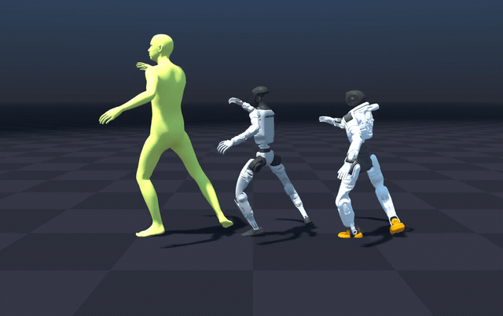
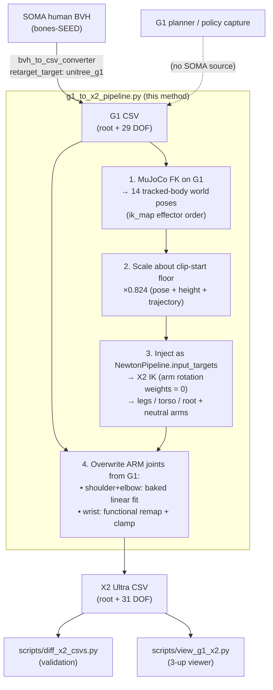

# G1 → X2 Ultra retargeting

A **standalone retargeting method** that maps **Unitree G1** motion onto the **Agibot X2
Ultra**, sitting alongside the existing SOMA→X2 recipes (`soma_to_x2_ultra`,
`chain_matched`, …). Where those retarget a *human* (SOMA) source, this one retargets a
*robot* (G1) source — for taking motions that only exist on G1 (e.g. G1 planner / policy
captures, or the bones-SEED corpus already retargeted to G1) onto X2.

It **reuses the same Newton IK solver** as the SOMA path, but drives it from **G1
forward-kinematics keypoints** instead of a human skeleton, then fixes the arms with a
**direct joint map**. Result vs. a reference X2 retarget: **~0.8 cm / 3.8° on walks**,
and correct, un-splayed, expressive arms on dances.



*Left → right: SOMA human, Unitree G1 (SOMA→G1), Agibot X2 Ultra (G1→X2, this method) — the same clip on all three.*

---

## Pipeline



### Why this shape

The design came from **isolating** where a naive G1→X2 breaks. Feeding the X2 IK the raw
G1 keypoints showed:

- **Positions are faithful everywhere** (reach ~0.83, direction within a few degrees) — the
  X2 IK and the G1 source are both fine.
- **The fault is arm *rotation*** — the G1 wrist frame is ~90° off from what the IK expects,
  and *dynamically* so (no static offset aligns it). So the arms cannot be fixed through the
  IK rotation objective; they are fixed by a **direct joint map** instead.

### The four stages

1. **G1 forward kinematics.** Load the same `g1_29dof_rev_1_0.xml` MuJoCo model that
   produced the G1 CSVs, set `qpos` per frame, and read the world pose of the 14 bodies the
   X2 `ik_map` tracks (pelvis, torso, and per-side hip-roll / knee / ankle-roll and
   shoulder-roll / elbow / wrist), in `ik_map` order. → `(frames, 14, 7)`, `[pos xyz,
   quat xyzw]`, meters, MuJoCo world frame.

2. **Scale.** Scale every keypoint about the **clip-start floor point**
   `[pelvis_x0, pelvis_y0, 0]` by `position_scale` (`0.824 = 1.40 / 1.70`, the X2/G1 height
   ratio). Scaling about the floor — not the per-frame pelvis — shrinks **height, pose, and
   the walk trajectory** together, so the shorter X2 walks the correct distance with feet on
   the ground.

3. **IK injection.** Populate `NewtonPipeline.input_targets` directly (bypassing the
   human→robot scaler) and run the standard X2 IK — LM solver, joint-limit clamp, feet
   stabilizer. The retargeter config has the **arm rotation weights zeroed** so the IK does
   not chase the (unusable) arm rotation. This yields correct **legs, torso, root** and
   **neutral arms**.

4. **Arm joint map.** Overwrite the X2 arm joint columns directly from the G1 CSV:
   - **shoulder (pitch/roll/yaw) + elbow** — a **baked per-joint linear fit** `X2 = a·G1 + b`
     (the two robots' shoulders/elbows correlate 0.81–0.96). Fixes arm *shape*.
   - **wrist** — a **functional remap by physical axis** (see below), clamped to X2 limits.

### The wrist: names lie, axes don't

The wrist joints do **not** map by name, because the vendors label them differently. The
**pronation** DOF (palm roll about the forearm long axis) is:

| motion | G1 joint | X2 joint | range |
|---|---|---|---|
| **pronation** (palm roll) | `wrist_roll` | **`wrist_yaw`** | G1 ±113° / X2 ±146° |
| flexion | `wrist_pitch` | `wrist_pitch` | G1 ±93° / X2 ±32° |
| deviation | `wrist_yaw` | `wrist_roll` | G1 ±93° / X2 −90…+41° |

So the map is **functional**, with a per-DOF sign (pronation is inverted on both arms):

```
X2 wrist_yaw   ← −G1 wrist_roll    (pronation)
X2 wrist_pitch ←  G1 wrist_pitch
X2 wrist_roll  ←  G1 wrist_yaw
```

All wrist values are **clamped to X2 joint limits**. X2's pronation range (±146°) is *wider*
than G1's, so palm-roll is fully reproduced; only extreme flexion (X2 `wrist_pitch` is just
±32°) is hardware-capped.

---

## Files

| Path | Role |
|---|---|
| `soma_retargeter/pipelines/g1_to_x2_pipeline.py` | The method — `G1ToX2Retargeter` class (FK → scale → inject → arm map) |
| `app/g1_csv_to_x2_csv.py` | Batch entry point: G1-CSV-dir → X2-CSV-dir |
| `soma_retargeter/configs/agibot_x2_ultra/g1_to_x2_ultra_retargeter_config.json` | IK config (arm `r_weight = 0`) |
| `soma_retargeter/configs/agibot_x2_ultra/g1_to_x2_ultra_calibration.json` | Self-contained: `position_scale`, baked shoulder/elbow fit, wrist remap |
| `scripts/diff_x2_csvs.py` | Validation — per-DOF + per-body FK diff of two X2 CSV sets |
| `scripts/view_g1_x2.py` | 3-up MuJoCo viewer: G1 \| X2-from-G1 \| X2-GT |
| `scripts/dev/calibrate_g1_to_x2.py` | (maintenance) re-derive the calibration config |

The calibration config is **self-contained** (the shoulder/elbow fit is baked in), so the
method runs on G1 motions that have **no** X2 ground truth (e.g. G1 planner captures).

### Regenerating the calibration

The calibration config is a frozen artifact; you only regenerate it if the robot models or
the paired reference data change. `scripts/dev/calibrate_g1_to_x2.py` re-derives all of it —
the scale (X2/G1 model-height ratio), the shoulder/elbow fit (from paired clips), and the
wrist correspondence + signs (from joint-axis geometry) — and writes the config:

```bash
.venv/bin/python scripts/dev/calibrate_g1_to_x2.py \
    --fit-pairs <g1a.csv>:<x2gta.csv> <g1b.csv>:<x2gtb.csv> ...
```

---

## Usage

```bash
# 1. Human BVH -> G1 CSVs  (existing converter, G1 target)
.venv/bin/python app/bvh_to_csv_converter.py --config <cfg with retarget_target: unitree_g1>

# 2. G1 CSVs -> X2 Ultra CSVs  (this method)
.venv/bin/python app/g1_csv_to_x2_csv.py --g1-dir <g1_csv_dir> --out-dir <x2_out_dir>
```

Optional overrides: `--config <retargeter.json>`, `--calibration <calibration.json>`,
`--g1-mjcf <path>`, `--device cuda:0`.

### Validate / view

```bash
# numeric diff vs a reference X2 retarget
.venv/bin/python scripts/diff_x2_csvs.py --test <x2_out_dir> --ref <x2_reference_dir>

# side-by-side G1 | X2-from-G1 | X2-GT  (run foreground; needs a display)
.venv/bin/python scripts/view_g1_x2.py --g1-dir <g1_csv_dir> --x2-dir <x2_out_dir> \
    [--x2-gt-dir <x2_reference_dir>] --clip <stem>
```

---

## Validation

| set | joint | effector pos | effector rot |
|---|---|---|---|
| walks (vs `x2_uniform_h14`) | **3.8°** | **0.8 cm** | **5.4°** |
| complex (hiphop / sit / crouch / balance, vs `x2/`) | 11.4° | 8.6 cm | 16.3° |

**Reading the numbers:** the wrist deliberately follows the *G1/human intent*, which
differs from a SOMA→X2 reference (whose weakly-weighted wrist compromised). So the wrist
term reads "high" vs. GT even though it is *more* correct — judge the wrist **visually**,
and read the numeric validation on **body / legs / arm-shape**. Complex clips are also
compared against a *different* recipe (`x2/` legacy) and are inherently harder than walks.

---

## Limitations

- **Wrist flexion is hardware-capped.** X2 `wrist_pitch` is ±32° (vs G1 ±93°), so extreme
  hand flexion is clamped. Pronation (the expressive palm-roll) is *not* capped (X2 yaw is
  wider than G1 roll).
- **Wrist deviates from SOMA→X2 GT by design** — it tracks intent, not the GT's compromise.
- **Shoulder/elbow fit** is a single global linear map baked from a handful of paired clips;
  it is robust but not per-clip optimal on very extreme poses.
