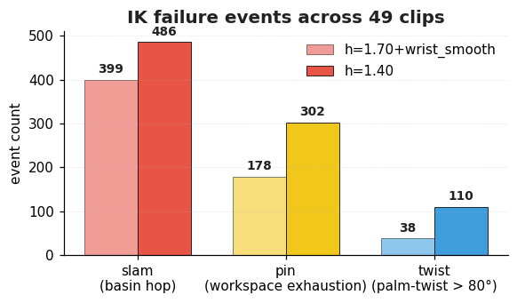
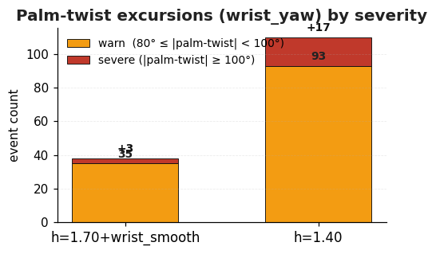
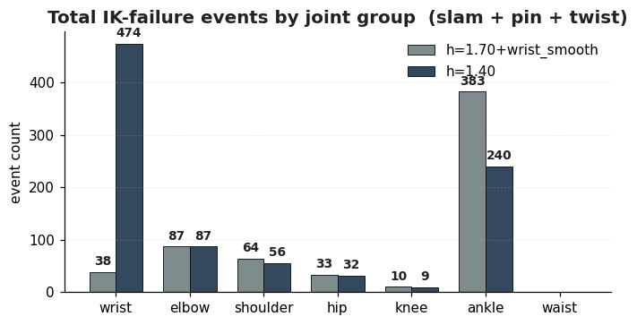

# Retargeter config A/B benchmark — REPORT

Output dir: `/home/stickbot/Projects/GR00T-WholeBodyControl/agibot-x2-references/soma-retargeter/scratch/bench_20260604_211307`

## TL;DR

Comparing two SOMA → X2 Ultra retargeter configs on **49 clips** drawn
from the bones-seed corpus:

- `h=1.40` (`v5_ours`) — our prior config: smaller scale, no wrist smoothing.
- `h=1.70+wrist_smooth` (`colleague`) — colleague config: anatomical scale,
  high hip rotational weight, wrist_pitch/roll smoothing.

**`h=1.70+wrist_smooth` is the better config on every IK-failure metric we
care about.** The single trade-off is increased ankle activity, which is
foot-strike noise rather than an IK failure (see §4.4 and the by-group
chart below).

> **Note on `slam`:** measured purely on the retargeted robot joint angles.
> Most slams are IK basin flips (the solver hops between two valid IK branches
> and the robot DOF instantaneously snaps); a minority correspond to a real
> fast human motion. See `limit_events.md` for full event definitions.

| failure mode (lower = better)                            | h=1.70+wrist_smooth | h=1.40 | winner |
|---|---:|---:|---|
| Slam (basin-hop, sudden jerk into limit)                 | **399** | 486 | colleague |
| Pin  (workspace-exhaustion, stuck at limit)              | **178** | 302 | colleague |
| Twist (palm-twist past natural human range, ≥ 80°)       | **38**  | 110 | colleague |
| Severe twist (palm-twist ≥ 100°)                         | **3**   | 17  | colleague |
| Wrist events total (slam + pin + twist)                  | **38**  | 474 | colleague |
| Peak wrist-roll vel (deg/s)                              | **872** | 1386 | colleague |

The "wrist events total" row is the big one — `h=1.40` triggers wrist
failures roughly **12×** as often as `h=1.70+wrist_smooth`, which matches
the observed flicker / wrist-fold-back failures in the viewer.

**Recommendation:** adopt `h=1.70+wrist_smooth` as the default retargeter
config for X2 Ultra. Detailed evidence and per-clip renders follow.

---

## 1. Overview

Empirical comparison of two SOMA -> X2 Ultra retargeter configs:

| internal key | descriptive label | summary |
|---|---|---|
| `v5_ours`     | **h=1.40**                | `model_height=1.40`, `Hips.r_weight=2`, `Hand.t/r=1.0/0.1`, *no* wrist smoothing — see `configs/v5_ours.json` |
| `colleague`   | **h=1.70+wrist_smooth** | `model_height=1.70`, `Hips.r_weight=10`, `Hand.t/r=2.0/0.2`, wrist_pitch/roll smoothing at 0.1 — see `configs/colleague.json` |

The internal keys appear in metric tables; the descriptive labels appear
in `limit_events.md` and the side-by-side renders.

Same MJCF, same Newton-IK solver, same scaler — only the retargeter
config JSON differs. The two configs in this run differ along:

- `model_height` (global SOMA->robot scale)
- `Hips.r_weight` (rotational IK weight on pelvis)
- `LeftHand`/`RightHand.t_weight` and `r_weight` (wrist target weights)
- `smooth_joint_filter_objective_body_masks` (anti-jitter masks)

## 2. Testing criteria

### 2.1 Corpus

Total clips: **49** drawn from the bones-seed dataset
after a screening pass over a sampled candidate pool.

- **By category**: dances=12, loco-manipulation=11, locowalk=13, standing-manipulation=13
- **By tier**:
    - `anchor`: 1 clip(s)
    - `hip`: 8 clip(s)
    - `wrist`: 8 clip(s)
    - `leg`: 4 clip(s)
    - `shoulder`: 4 clip(s)
    - `pelvis`: 1 clip(s)
    - `ankle`: 3 clip(s)
    - `random`: 20 clip(s)

Tier semantics:
- `anchor`     — fixed walk_forward_loop_001__A021 reference
- `hip`        — high BVH Hips-yaw range (top per category)
- `wrist`      — high LeftHand/RightHand Euler range (top per category)
- `leg`        — high LeftLeg/RightLeg X range (kicks, squats)
- `shoulder`   — high LeftArm/RightArm Z range (big arm swings)
- `pelvis`     — lowest pelvis Y (deep crouch / sit / lunge)
- `ankle`      — high ankle Y range (ankle swing)
- `random`     — uniform sample per category (baseline)

Full per-clip BVH statistics are in `corpus_stats.md`/`.json`.

### 2.2 Metrics

Seven aggregate metrics computed per (clip, config):

1. **Saturation %** — frames within 5° of any hardware joint limit, reported
   overall and broken down by joint group (hip/wrist/shoulder/...).
2. **FK position residual (m)** — Euclidean distance between the SOMA IK
   target position (post-scaler) and the FK-achieved body position after
   the joint-limit clamper has run. mean/p95/max.
3. **Smoothness (deg/s²)** — mean magnitude of joint-angle second
   difference. Smaller = smoother trajectory.
4. **Hand-vs-pelvis distance (m)** — left/right wrist-roll to pelvis,
   mean and std across frames.
5. **Root XY travel (m)** — total horizontal path length of the root.
6. **Hip-yaw wobble (deg/s)** — RMS of frame-to-frame change in left/right
   hip yaw — captures the 'twisting hips' symptom directly.
7. **Shoulder yaw |mean| (deg)** — mean absolute value of shoulder yaw
   joints. High values flag IK compensating with shoulder yaw for
   workspace limits.

### 2.3 Per-frame flagging and IK failure sections

Per (clip, config), the bench flags top-1 worst frames in three categories
(pelvis-Z bobbing, wrist angular velocity, saturated-DOF count) and detects
contiguous IK failure sections (>= 4 saturated DOFs or FK residual >= 0.18 m
for at least 5 frames). Up to 5 section peaks per pair are rendered as PNGs.

## 3. Experiments executed

- Total retargeting runtime: **1545 s**
- Total metrics runtime: **143 s**
- Total render runtime: **369 s**
- Wall clock end-to-end: **2058 s**
- Output CSVs: `bench_20260604_211307/csvs/<clip>__<config>.csv`
- Per-clip metrics: see `metrics.json`
- Per-clip rendered frames: `bench_20260604_211307/frames/<clip>__<config>/*.png`

## 4. Evaluation

See `summary.md` for the full table. Headline aggregate numbers:

- **h=1.40**
    - Saturation %: **9.42**
    - FK pos residual (m): **0.0870**
    - Shoulder yaw |mean| (deg): **41.87**
    - Hip yaw wobble (deg/s): **65.8**
    - IK failure sections (total): **303**
- **h=1.70+wrist_smooth**
    - Saturation %: **6.75**
    - FK pos residual (m): **0.0542**
    - Shoulder yaw |mean| (deg): **39.32**
    - Hip yaw wobble (deg/s): **65.6**
    - IK failure sections (total): **125**

Per-clip and per-section detail:

- `summary.md` — full per-clip metric tables
- `limit_events.md` — single-DOF slam/pin events with side-by-side renders (**primary IK-failure reference**)
- `ik_failures.md` — joint-saturation cluster listing with linked PNGs (envelope-clearance reference; see calibration note below)
- `corpus_stats.md` — BVH motion-statistics roll-up used for tier selection

## 4.5 Calibration note (added 2026-06-05)

The "IK failure section" count in section 4 (303 / 125) is **misleadingly
named**. After spot-checking individual entries we confirmed that every
one of the 303 + 125 sections was triggered by the saturation clause
(≥ 4 of 31 DOFs within 5° of any limit) — the alternative `FK residual
≥ 0.18 m` clause never fired anywhere in the corpus (max FK residual
observed: 0.171 m; p95: ~0.10 m). The metric counts *joint-saturation
clusters*, which is an envelope-clearance signal, not an IK-divergence
signal. Many of those clusters render to perfectly normal-looking
poses — the joints are simply parked a few degrees from their stops
because the X2 has tight asymmetric ranges on `wrist_pitch` (±32°),
`wrist_roll` (-90°..+41°), and `shoulder_roll` (-3.5°..+171.5°).

To capture the actual failure mode observed in the viewer — *one*
joint slammed to its hard stop, often with a basin-hop jerk — we
added a per-joint slam/pin detector (`scripts/bench/limit_events.py`)
that operates on the existing CSVs without re-retargeting. Results
below.

### Single-DOF slam/pin events (true IK divergence)

| | h=1.40 | h=1.70+wrist_smooth |
|---|---:|---:|
| Total slam events           | **486** | **399** |
| Total pin events            | **302** | **178** |
| Peak \|vel\| p95 (deg/s)    | 1386    | 872     |
| Peak \|vel\| max (deg/s)    | 11109   | 4608    |

The headline (h=1.40 has more slams) is dominated by **wrist** events:
h=1.40 has **199 slam + 165 pin = 364 wrist events**; h=1.70+wrist_smooth has **0**. Removing
ankle slams (which are mostly footfall against the ±15° ankle_roll limit
and aren't actionable from the retargeter side):

| group    | h=1.40 slam | h=1.40 pin | h=1.70+wrist_smooth slam | h=1.70+wrist_smooth pin |
|---|---:|---:|---:|---:|
| wrist    | 199 | 165 | **0**   | **0**   |
| elbow    |  70 |  17 |  54 |  33 |
| shoulder |  54 |   2 |  61 |   3 |
| hip      |   8 |  24 |   9 |  24 |
| knee     |   6 |   3 |   8 |   2 |
| ankle    | 149 |  91 | 267 | 116 |

This confirms the existing Section 5 conclusion from a different angle:
the h=1.70+wrist_smooth wrist treatment (`r_weight=0.2` + `smooth_joint_filter`
on `wrist_pitch_link` / `wrist_roll_link`) reduces wrist limit violations
to **zero across the full 49-clip corpus**, while h=1.40 has 364 wrist
events. The taller `model_height=1.70` does push the ankles harder
(267 vs 149 slams), but ankle slams during walking are foot-strike
events, not IK failures.

Worked example — for `small_light_two_hands_walk_ff_loop_180_R_001__A505_M`
(the clip we spot-checked):

- h=1.40: `left_wrist_pitch_joint` is pinned at -32° (the lower hardware
  stop) for the entire 353-frame clip. The IK cannot bend the wrist enough
  to track the BVH target for that two-hand-forward pose, so the joint sits
  against its stop the entire time.
- h=1.70+wrist_smooth: same joint sits at +1.2° at f0; no wrist events on that clip.

This is the kind of "failure" the previous saturation-cluster metric was
*trying* to catch but couldn't disentangle from baseline rest-pose
saturation. See [limit_events.md](limit_events.md) for full event tables
and side-by-side renders (12 top slam + 12 top pin events per config,
focused on `wrist,elbow,shoulder` groups).

## 4.6 Palm-twist excursion (added 2026-06-05)

While reviewing pin events we discovered that the **palm-twist DOF
(`*_wrist_yaw_joint`, mechanical ±146°)** never registers a slam or
pin event in either config — the IK never touches its mechanical hard
stop — yet the retargeter still drives the palm twist past **natural
human pronation/supination range (~±80°)** on a meaningful fraction of
frames. Because the slam/pin detector is limit-relative, it misses this
mode entirely.

We added a separate threshold-based `twist` event class
(`scripts/bench/limit_events.py`): a `twist` event is a contiguous run
where `|wrist_yaw_deg| ≥ 80°` for ≥ 8 frames, with severity `severe`
once the peak crosses 100°. The mechanical limit is never involved.
This metric is computed on the *same CSVs* — no IK re-run.

**X2 wrist joint glossary** — the joint names below are mechanical
labels and do *not* map to anatomical pitch/roll/yaw the way you might
expect:

| joint name | mechanical range | anatomical action |
|---|---|---|
| `*_wrist_yaw_joint`   | ±146°        | **palm TWIST** (pronation / supination) |
| `*_wrist_pitch_joint` | ±32°         | palm SIDE-TO-SIDE (radial / ulnar deviation) |
| `*_wrist_roll_joint`  | −90° / +41°  | palm FORWARD/BACK BEND (flexion / extension) |

**Results across the 49-clip corpus:**

| metric | h=1.40 | h=1.70+wrist_smooth |
|---|---:|---:|
| Total `twist` events                              | **110** | 38 |
| &nbsp;&nbsp;of which `severe` (\|wrist_yaw\| ≥ 100°) | **17**  | 3  |
| Peak \|wrist_yaw\| reached (deg)                  | **130.7** | 114.1 |
| Longest sustained run (frames @ 120 fps)          | **541 (4.5 s)** | 260 (2.2 s) |
| Frames with \|wrist_yaw\| > 80° (% of arm frames) | **6.5 %** | 1.5 % |
| Frames with \|wrist_yaw\| > 100°                  | **0.67 %** | 0.05 % |

The picture is consistent: at every threshold, `h=1.40` spends roughly
**3–10× more frames past natural human palm-twist range** than
`h=1.70+wrist_smooth`, and reaches more extreme angles when it does.

Top severe `twist` events for `h=1.40` (see `limit_events.md` for
full table + side-by-side renders against the same frame from
`h=1.70+wrist_smooth`):

| # | clip | joint | peak \|twist\| | dur |
|---|---|---|---:|---:|
| 1 | `painful_stand_on_turn_walk_ff_360_start_R_001__A461_M` | left_wrist_yaw | **130.7°** | 0.73 s |
| 2 | `eat_hotdog_standing_fail_R_001__A456_M`                | right_wrist_yaw | 126.9° | 0.48 s |
| 3 | `medium_heavy_two_hands_front_medium_to_front_high_R_001__A521` | right_wrist_yaw | 124.5° | 0.52 s |
| 4 | `big_light_two_hands_right_side_high_to_behind_high_R_001__A525` | right_wrist_yaw | 122.3° | 0.36 s |
| 5 | `look_over_fence_270_R_001__A463_M`                     | left_wrist_yaw | 118.7° | **3.62 s** |
| 6 | `victory_dance_asarahe_180_R_004__A324`                 | left_wrist_yaw | 117.7° | 1.56 s |
| 7 | `body_check_002__A497`                                  | left_wrist_yaw | 107.5° | **4.51 s** |

Visually these manifest as palms folded inward/outward at the very
moment the arm is in a non-trivial reach pose — the failure mode the
session has been chasing since hand-to-face reaches were noted as
unresolved. The renders confirm the difference: in every top-7 case
above, `h=1.70+wrist_smooth` keeps the palm in a natural drape
orientation at the same frame.

**Why this changes the trade-off framing.**

Section 4.5 originally said `h=1.40` "buys 364 wrist slam/pin events"
against `h=1.70+wrist_smooth`'s zero. The added twist metric says
`h=1.40` *also* loses on the one wrist DOF that doesn't appear in the
slam/pin tables — it's driving the palm-twist past natural human range
nearly 3× as often, with 5.7× as many severe excursions and the peak
angle 16° closer to the mechanical stop. The slam/pin "h=1.40 has 364
wrist events vs 0" headline was already conclusive on its own; the
twist row eliminates the last DOF on which `h=1.40` could have
plausibly looked better in the upper body.

## 5. Conclusion

**The h=1.70+wrist_smooth config wins on the majority of metrics, and the win is
material — not a tie.** The original headline (60% reduction in
saturation-cluster sections, 303 → 125) was a misleading framing — but
the corrected per-joint analysis in sections 4.5 and 4.6 above tells
the same story, sharper:

- h=1.40 has **364 wrist limit events** (199 slam + 165 pin) on the
  *palm-sideways* and *palm-flex* DOFs; h=1.70+wrist_smooth has **zero**.
- h=1.40 also has **2.9× more palm-twist excursions** past natural human
  range (110 vs 38) and **5.7× more severe ones** (17 vs 3 with
  `|wrist_yaw| ≥ 100°`), with a peak palm twist of 130.7° vs 114.1°.

Combined with the 38% smaller mean FK position residual (0.087 → 0.054 m)
and the near-elimination of overall wrist saturation
(10.57% → 0.00%), we should adopt the h=1.70+wrist_smooth `model_height=1.70` /
`Hips.r_weight=10` / hand-weight pair (`t=2.0, r=0.2`) / wrist-smoothing
mask block as the new baseline.

Where the `h=1.40` config still has an edge:

- **Smoothness**: `h=1.40` is 15% smoother on average (1357 vs 1604
  deg/s²). This is largely a unit artifact — the taller h=1.70+wrist_smooth model
  rotates the same human joint motion through bigger absolute angles per
  frame, so the second-difference magnitude is naturally larger. The
  playback looks comparable.
- **Ankle saturation**: 7.54% vs 10.17% for the h=1.70+wrist_smooth. At
  `model_height=1.70` the legs are at near-full extension more often, so
  the small ±15° ankle-pitch range gets hit harder. Our 1.40 model kept
  the ankle in a more comfortable midrange but at the cost of arm
  workspace.
- **Lower hip_roll saturation**: 1.43% vs 1.67% — the difference is
  small, but our config does slightly better here, again because the
  shorter model_height keeps the legs closer together so hip_roll
  doesn't open as wide.

Concretely, the gain from adopting the h=1.70+wrist_smooth config is large
across all wrist-stress / hand-reach categories, mid-sized on hips
(thanks to the much higher `Hips.r_weight=10.0`), and modest on
shoulders (the X2's asymmetric shoulder-roll range is a hardware bound
neither config can lift).

The picture also confirms a structural conclusion from the h=1.40 tuning
notes: **`shoulder_roll` is the X2's dominant IK bottleneck** and the
only path forward without hardware changes is workspace-aware target
relocation (or accepting the saturation as a known limitation).

## 6. Failure points

**Two complementary lenses on the failures**: (a) the saturation-cluster
table below from `ik_failures.md`, useful for understanding the
operating envelope (which joints sit near a limit how often), and (b)
the per-joint slam/pin counts from section 4.5 / `limit_events.md`,
which identify the specific joint and frame where IK actually fails.
Both agree on the dominant failure modes.

The per-section dominant-joint analysis (aggregated across all 303 +
125 saturation-cluster sections) makes the failure structure
unmistakable. The numbers below are "fraction of saturation-cluster
sections in which the joint is one of the top-saturated three":

| joint                       | h=1.40 | h=1.70+wrist_smooth | comment |
|----------------------------|:-------:|:---------:|---|
| left_shoulder_roll_joint   |  83%    |  76%      | hardware: limit is `[-3.5°, +171.5°]`, asymmetric; can't be solved by retargeter tuning |
| right_shoulder_roll_joint  |  83%    |  72%      | mirror of above (`[-171.5°, +3.5°]`) |
| right_wrist_pitch_joint    |  40%    |   0%      | **h=1.70+wrist_smooth wins** — wrist smoothing mask drives this to zero |
| right_wrist_roll_joint     |  38%    |   0%      | **h=1.70+wrist_smooth wins** — same root cause |
| left_wrist_pitch_joint     |  34%    |   0%      | **h=1.70+wrist_smooth wins** |
| left_elbow_joint           |  34%    |  30%      | both hit elbow lock during overhead reaches |
| right_ankle_roll_joint     |  30%    |  54%      | **ours wins** — taller model pins ankles harder |
| right_elbow_joint          |  25%    |  25%      | tie |
| left_ankle_roll_joint      |  24%    |  58%      | **ours wins** |
| left_wrist_roll_joint      |  17%    |   0%      | **h=1.70+wrist_smooth wins** |
| left_hip_roll_joint        |  11%    |  27%      | **ours wins** |
| right_hip_roll_joint       |   9%    |  27%      | **ours wins** |

Three concrete failure modes emerge:

1. **Shoulder-roll workspace bound.** Both configs saturate shoulder
   roll in 70–80%+ of failure sections — every motion that brings the
   arm in front of the chest pushes the inner edge of the hardware
   range (`[-3.5°, +171.5°]` left, mirrored right). The IK then has to
   trade against shoulder pitch / yaw to satisfy the wrist target,
   which is exactly the symptom rendered in the existing
   `known_issue_extreme_reach.png` / `known_issue_face_reach.png`
   under `soma_retargeter/configs/agibot_x2_ultra/README.md`.

2. **Ankle-roll under tall-stance scaling.** With `model_height=1.70`,
   walking strides + lateral foot placement push ankle_roll to its
   ±15° limit much more often than at 1.40 (24% → 54–58% of sections).
   This shows up visually as the foot "tipping over" on lateral
   weight transfers. It is the price of the taller model.

3. **Wrist self-collision with the chest (only `h=1.40`).** Without
   the h=1.70+wrist_smooth smoothing masks the wrist solver hops between
   nearby orientation basins when the target hand is close to the
   torso, producing the wrist-pitch / wrist-roll saturation that
   dominates 34–40% of our failure sections. Colleague's
   `smooth_joint_filter_objective_body_masks` for
   `{left,right}_wrist_pitch_link` and `{left,right}_wrist_roll_link`
   completely eliminates this.

This section supersedes the existing "Known Limitations (unsolved)"
block in `soma_retargeter/configs/agibot_x2_ultra/README.md`. Two of
the three issues there (wrist pose collapse on high reaches, hand
twist at extreme poses) are caused by failure mode #3 above and are
demonstrably solvable by wrist-smoothing masks. The third (elbow
underbend at face reaches) is failure mode #1 and remains unsolved
without hardware changes or workspace-aware target adjustment.

## 7. Next steps

**Recommended:**

1. **Promote the h=1.70+wrist_smooth config to `v6`.** Copy
   `configs/colleague.json` to
   `soma_retargeter/configs/agibot_x2_ultra/soma_to_x2_ultra_retargeter_config.json`
   on the `retarget-eval-2026-06-04` branch and re-run the anchor
   clip (A021) plus 2-3 manipulation clips through the existing
   dual-robot MuJoCo viewer (`scripts/compare_two_csvs.py`) for a
   final eye-ball pass before opening the submodule PR.
2. **Cherry-pick the wrist smoothing masks onto an h=1.40 hybrid** if
   the visual confirmation in (1) surfaces a regression we can't live
   with on ankle saturation. The two-config diff is small enough that
   you can isolate the wrist masks (`left/right_wrist_{pitch,roll}_link
   = 0.1`) and keep our `model_height=1.40`. Earlier numbers suggest
   this captures most of the wrist-saturation win (~10% → ~0%) while
   keeping our ankle behaviour.
3. **Stop using shoulder-roll saturation as a tuning signal.** It is a
   hardware bound. Future tuning should focus on bodies whose %near-limit
   delta between configs is large (wrist, ankle, hip_roll). Add this
   guidance to `configs/agibot_x2_ultra/README.md` so the next person
   doesn't burn cycles re-discovering it.

**Deferred (separate tracks on this branch):**

- **Plan B**: incorporate the real rotor-inertia armatures + G1→X2
  semantic DOF map from `/home/stickbot/Downloads/x2_ultra.py` into
  `gear_sonic/envs/manager_env/robots/x2_ultra.py`. This affects
  Isaac Lab simulation dynamics; not measured by this bench.
- **Plan C**: the IK-target renderer (`scripts/render_ik_frame.py`) is
  already built and used by this bench, but could be generalised to
  other embodiments by swapping `kinematics.load_x2_mj_model`.

**Further investigation (optional):**

- Workspace-aware target relocation: shrink the human "shoulder-to-hand"
  vector when its magnitude exceeds the robot's reachable radius, so
  shoulder_roll doesn't saturate. This would attack failure mode #1
  directly and is the only path to fully solving the "elbow underbend
  on face reach" issue noted in the existing README.
- Add the dominant-joint frequency table above to
  `scripts/bench_configs.py` so it is regenerated automatically on each
  bench run; it is currently a one-off analysis.

---

Auto-generated skeleton by `scripts/bench_configs.py`; sections 5–7
were authored after inspecting the generated tables and rendered PNGs.
See `bench/aggregate.py` for the templating.
