# Single-DOF slam / pin events

Per-joint detector that matches the actual failure mode observed in the viewer:
a *single* joint slammed against its hard stop, optionally with a basin-hop jerk.

**Definitions** (all per joint, per (clip, config)):

- `pinned[f]` = `|angle[f] - limit| <= 1.0 deg`
- `slam`      = pinned run with `max |vel| >= 200 deg/s` at entry or exit (sudden snap)
  - *measured on the retargeted robot DOF only — the human BVH velocity does not enter this calc.*
  - *most slams = IK basin flip (solver jumped between wrist/elbow branches, robot DOF snaps in 1–2 frames). Fast human motion can also drive a slam but is the minority case.*
- `pin`       = pinned run that lasts `>= 8` frames without a sudden transition (workspace exhaustion)
- `twist`     = sustained run where `|wrist_yaw| >= 80 deg`
                (palm-twist past natural human pronation/supination, even though the mechanical ±146° limit is never hit;
                severity `severe` once `|wrist_yaw| >= 100 deg`)
- short pins without a velocity transition are discarded as noise

FPS: 120.0. Internal gaps up to 2 frames are tolerated within a slam/pin run, 
and up to 4 frames within a twist run.

**X2 wrist-joint glossary** (the joint names below are mechanical labels and do *not* match anatomical pitch/roll/yaw):

| joint name | mechanical range | anatomical action |
|---|---|---|
| `*_wrist_yaw_joint`   | ±146°        | **palm TWIST** (pronation / supination) |
| `*_wrist_pitch_joint` | ±32°         | palm SIDE-TO-SIDE (radial / ulnar deviation) |
| `*_wrist_roll_joint`  | −90° / +41°  | palm FORWARD/BACK BEND (flexion / extension) |

Side-by-side renders shown below were generated with `--limit-events-groups wrist,elbow,shoulder` 
(top events on those groups only — leg/ankle slams are mostly foot-strike events, not IK failures, 
so we skip rendering them). Each render is a 3-row strip: 
**(top) human BVH stick figure**, **(middle/bottom) the two retargeter configs**, with columns 
`peak-3 / peak / peak+3`. Red/green/blue axis tripods = the SOMA IK target pose; yellow lines = 
the FK residual to the achieved body position.

**Config legend:**
- `colleague` → **h=1.70+wrist_smooth**
- `v5_ours` → **h=1.40**

## Overall event counts

| | h=1.70+wrist_smooth | h=1.40 |
|---|---:|---:|
| Total slam events  | 399 | 486 |
| Total pin events   | 178 | 302 |
| Total twist events | 38 | 110 |
| &nbsp;&nbsp;of which severe (|twist| ≥ 100°) | 3 | 17 |
| Mean slam / clip  | 8.14 | 9.92 |
| Mean pin / clip   | 3.63 | 6.16 |
| Mean twist / clip | 0.78 | 2.24 |
| Peak |twist| (deg)| 114.1 | 130.7 |
| Longest twist run (frames) | 260 | 541 |
| Peak |vel| (p95)  | 872 | 1386 |
| Peak |vel| (max)  | 4608 | 11109 |

### Visual summary

# Renders — grouped by anatomical action

Each section below shows the top events on one DOF (or joint group) — **both configs are visible in every render** (rows: human BVH on top, then each config). The previous category-x-config grouping is now in the appendices at the bottom of this file.

## Wrist — palm TWIST (wrist_yaw) — palm rotates around the forearm

Threshold-based detector: palm twist past natural human pronation/supination (`|wrist_yaw| ≥ 80°`). Severity flips to `severe` past 100°. The mechanical ±146° limit is never touched, so slam/pin miss this entirely.

| # | clip | joint | cat | start | end | peak frame | duration (s) | summary metric |
|---:|---|---|---|---:|---:|---:|---:|---:|
| 1 | `painful_stand_on_turn_walk_ff_360_start_R_001__A461_M` | left_wrist_yaw_joint | twist | 846 | 933 | 856 | 0.73 | |twist|=130.7° (sev `severe`) |
| 2 | `eat_hotdog_standing_fail_R_001__A456_M` | right_wrist_yaw_joint | twist | 1079 | 1136 | 1104 | 0.48 | |twist|=126.9° (sev `severe`) |
| 3 | `medium_heavy_two_hands_front_medium_to_front_high_R_001__A521` | right_wrist_yaw_joint | twist | 383 | 444 | 410 | 0.52 | |twist|=124.5° (sev `severe`) |
| 4 | `big_light_two_hands_right_side_high_to_behind_high_R_001__A525` | right_wrist_yaw_joint | twist | 789 | 831 | 806 | 0.36 | |twist|=122.3° (sev `severe`) |
| 5 | `look_over_fence_270_R_001__A463_M` | left_wrist_yaw_joint | twist | 285 | 718 | 489 | 3.62 | |twist|=118.7° (sev `severe`) |
| 6 | `victory_dance_asarahe_180_R_004__A324` | left_wrist_yaw_joint | twist | 865 | 1051 | 871 | 1.56 | |twist|=117.7° (sev `severe`) |
| 7 | `eat_hotdog_standing_fail_R_001__A456_M` | right_wrist_yaw_joint | twist | 1075 | 1136 | 1095 | 0.52 | |twist|=114.1° (sev `severe`) |
| 8 | `victory_dance_asarahe_180_R_004__A324` | left_wrist_yaw_joint | twist | 828 | 838 | 832 | 0.09 | |twist|=108.9° (sev `severe`) |
| 9 | `victory_dance_asarahe_180_R_004__A324` | right_wrist_yaw_joint | twist | 885 | 1048 | 1036 | 1.37 | |twist|=108.4° (sev `severe`) |
| 10 | `body_check_002__A497` | left_wrist_yaw_joint | twist | 40 | 580 | 194 | 4.51 | |twist|=107.5° (sev `severe`) |

_Renders (rows: human / h=1.70+wrist_smooth / h=1.40). Click an image to expand._

**#1 — `painful_stand_on_turn_walk_ff_360_start_R_001__A461_M` :: left_wrist_yaw_joint @ f856 (twist, |twist|=130.7° dur=0.73s)**

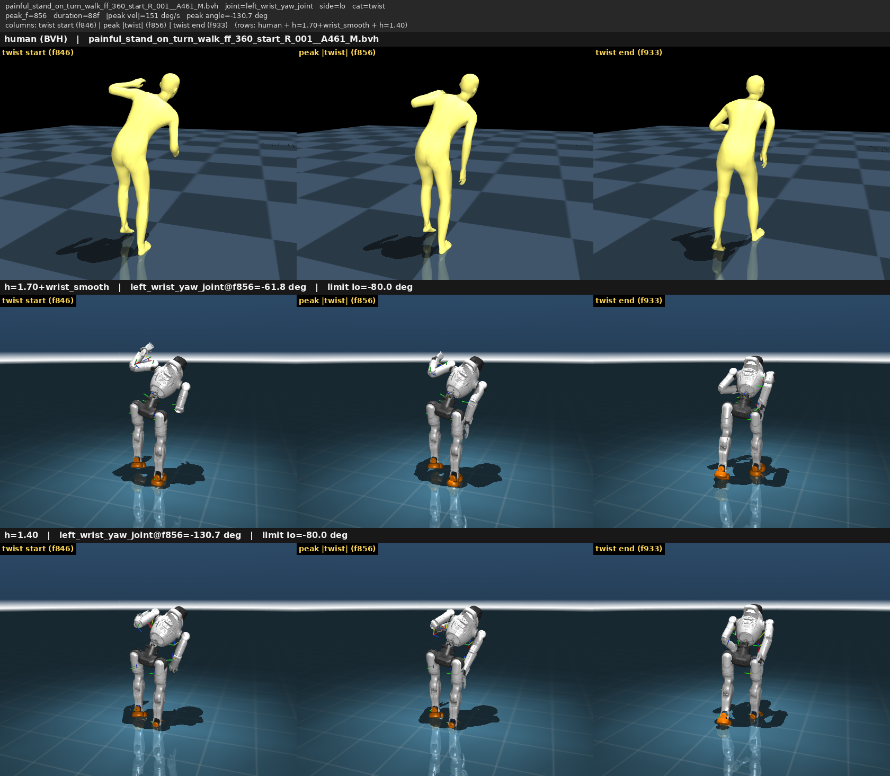

**#2 — `eat_hotdog_standing_fail_R_001__A456_M` :: right_wrist_yaw_joint @ f1104 (twist, |twist|=126.9° dur=0.48s)**

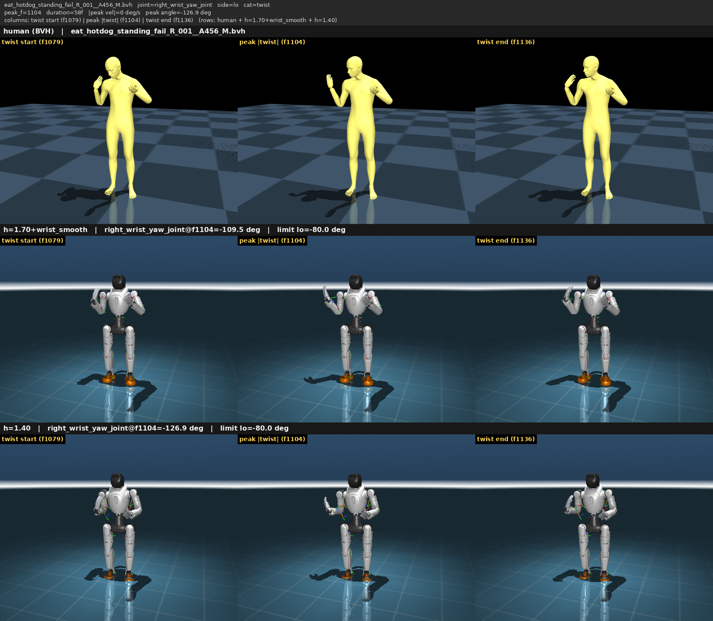

**#3 — `medium_heavy_two_hands_front_medium_to_front_high_R_001__A521` :: right_wrist_yaw_joint @ f410 (twist, |twist|=124.5° dur=0.52s)**

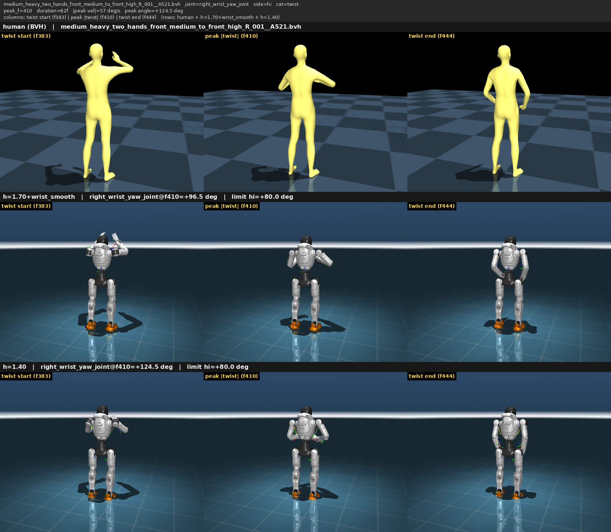

**#4 — `big_light_two_hands_right_side_high_to_behind_high_R_001__A525` :: right_wrist_yaw_joint @ f806 (twist, |twist|=122.3° dur=0.36s)**

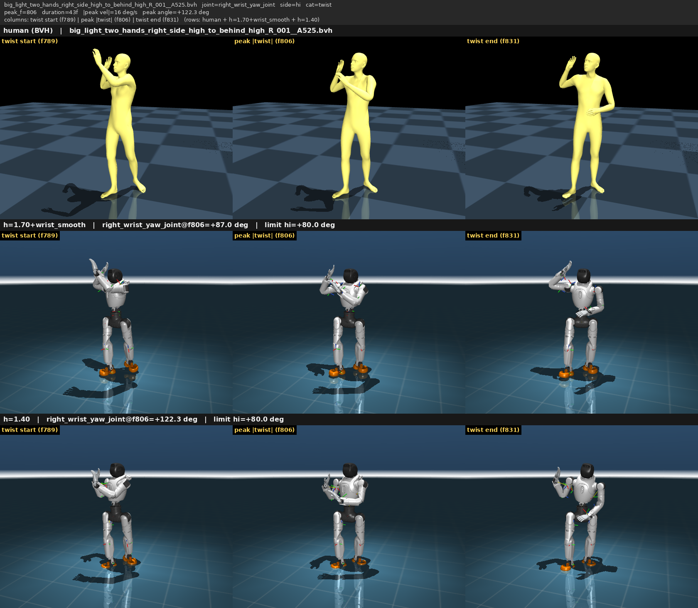

**#5 — `look_over_fence_270_R_001__A463_M` :: left_wrist_yaw_joint @ f489 (twist, |twist|=118.7° dur=3.62s)**

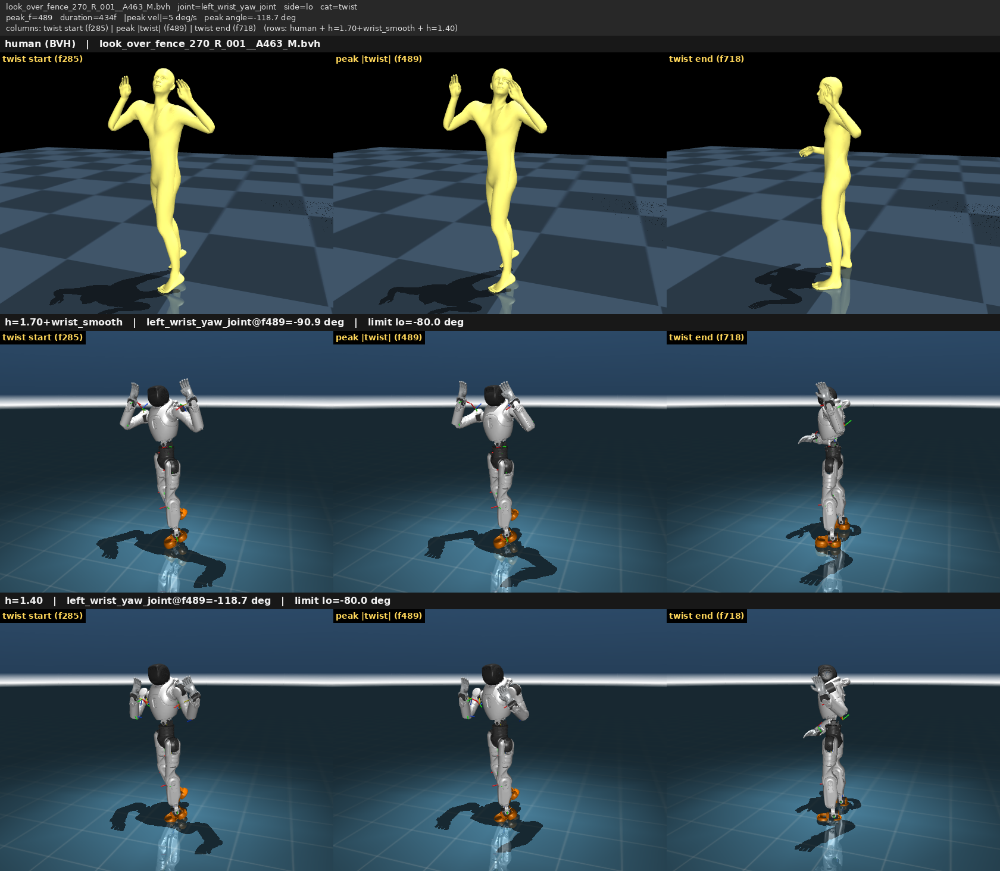

**#6 — `victory_dance_asarahe_180_R_004__A324` :: left_wrist_yaw_joint @ f871 (twist, |twist|=117.7° dur=1.56s)**

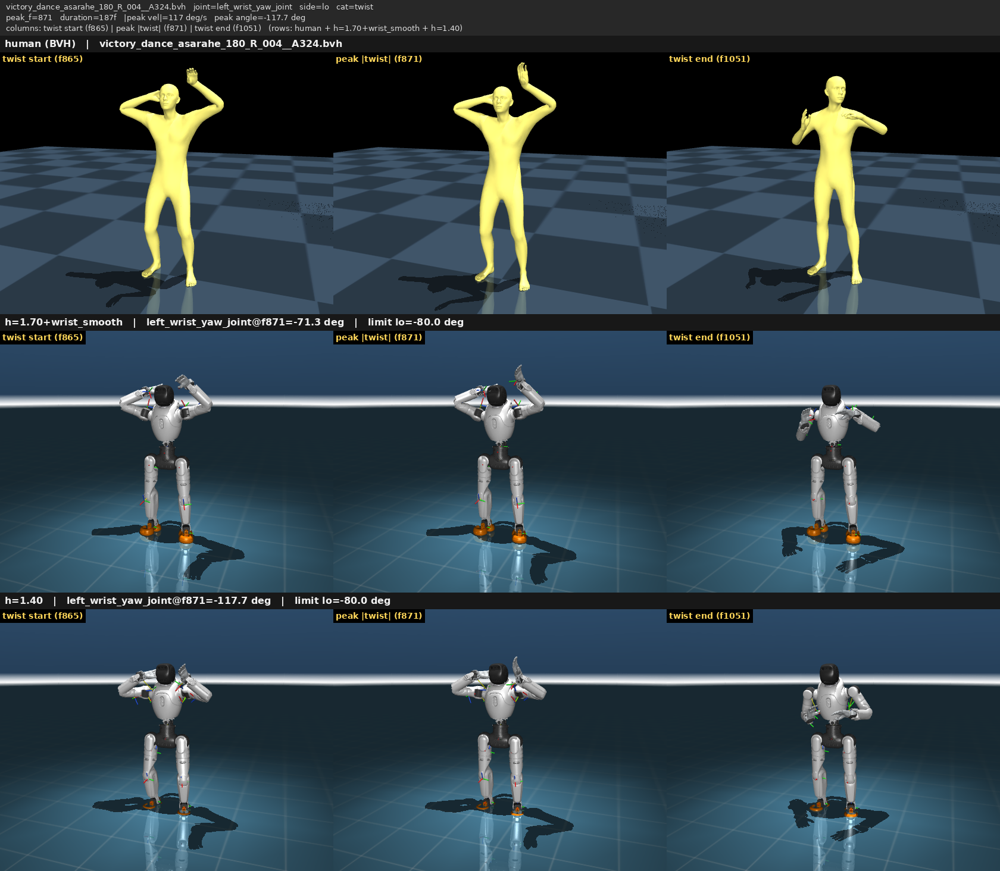

**#7 — `eat_hotdog_standing_fail_R_001__A456_M` :: right_wrist_yaw_joint @ f1095 (twist, |twist|=114.1° dur=0.52s)**

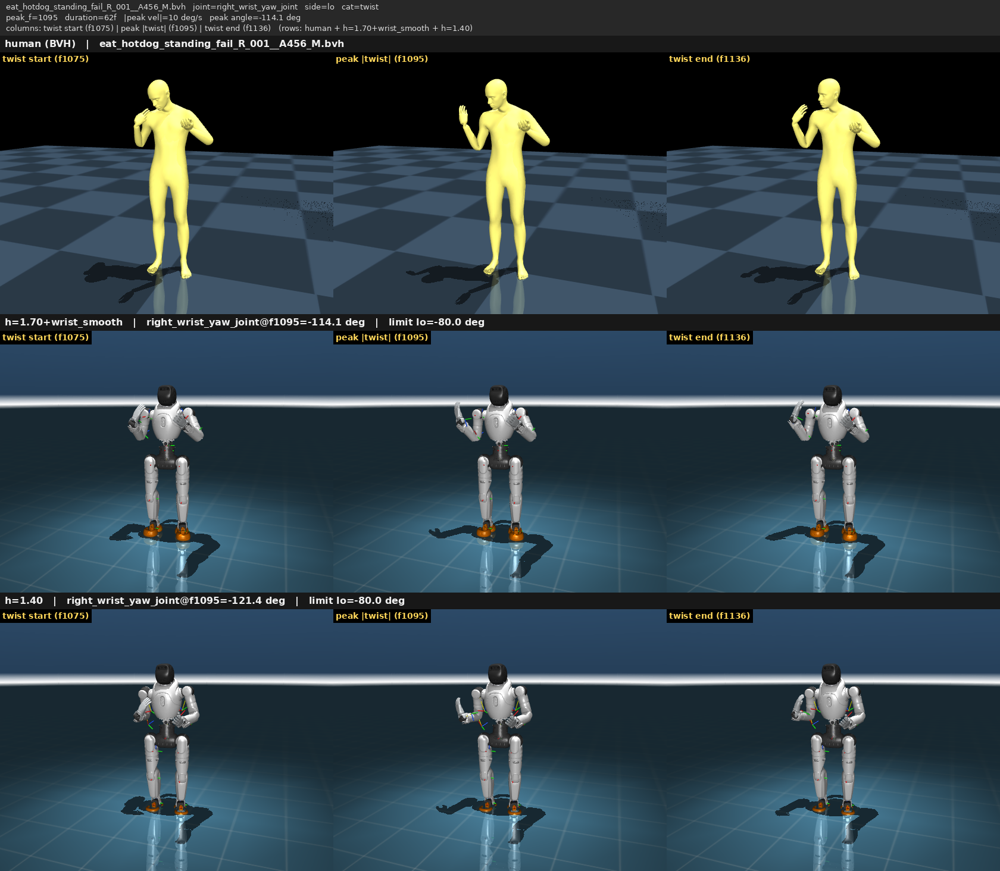

**#8 — `victory_dance_asarahe_180_R_004__A324` :: left_wrist_yaw_joint @ f832 (twist, |twist|=108.9° dur=0.09s)**

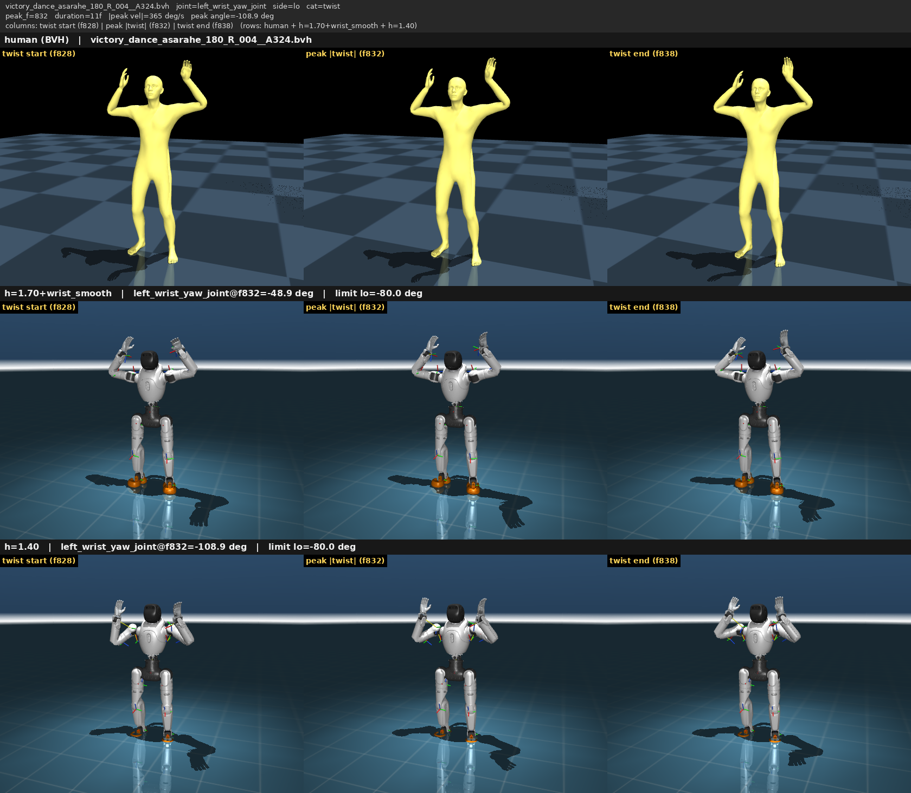

**#9 — `victory_dance_asarahe_180_R_004__A324` :: right_wrist_yaw_joint @ f1036 (twist, |twist|=108.4° dur=1.37s)**

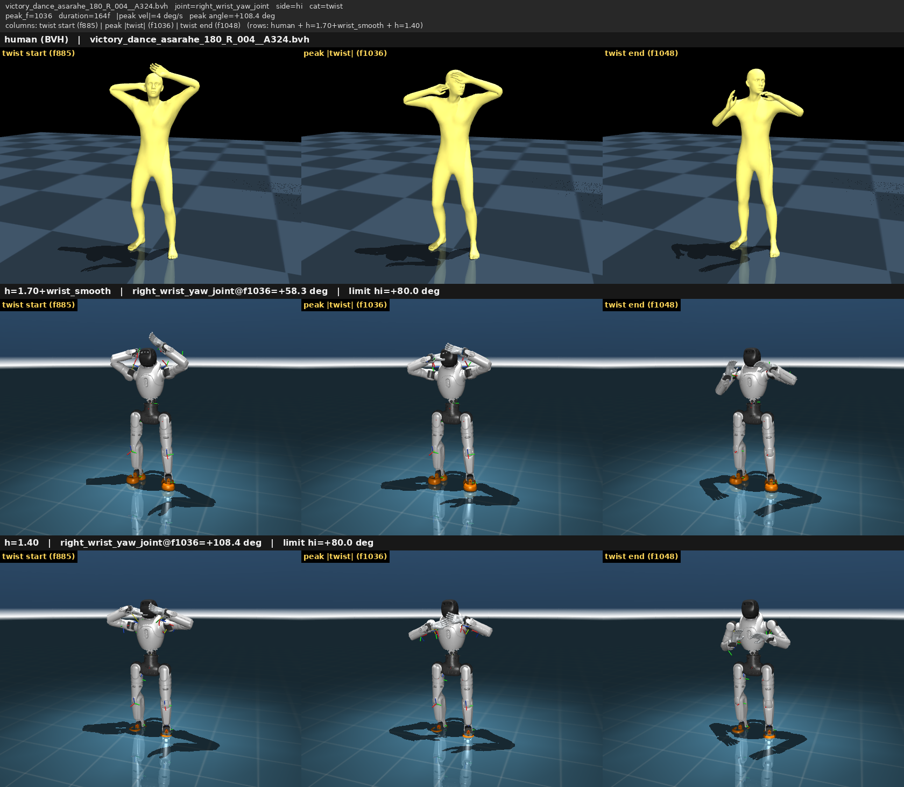

**#10 — `body_check_002__A497` :: left_wrist_yaw_joint @ f194 (twist, |twist|=107.5° dur=4.51s)**

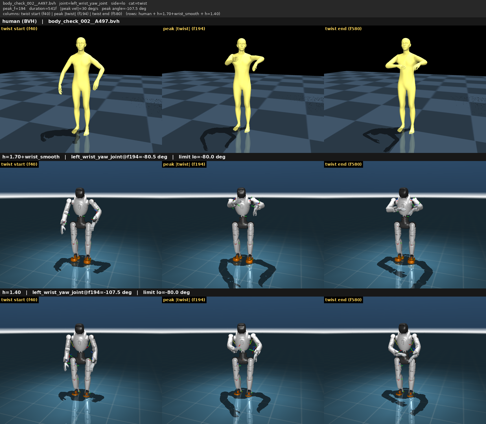

## Wrist — palm SIDE-TO-SIDE (wrist_pitch) — radial / ulnar deviation, ±32°

The small ±32° DOF. Pins here mean the IK gave up palm-sideways accuracy.

| # | clip | joint | cat | start | end | peak frame | duration (s) | summary metric |
|---:|---|---|---|---:|---:|---:|---:|---:|
| 1 | `dance_latino_chase_mambo_pivot_R_001__A313` | right_wrist_pitch_joint | pin | 23 | 845 | 24 | 6.86 | angle@stop=-32.0° for 823 f |
| 2 | `dance_hiphop_funky_guitar_R_fast_001__A319` | left_wrist_pitch_joint | slam | 35 | 537 | 37 | 4.19 | peak vel=+509 deg/s |
| 3 | `body_check_004__A444` | right_wrist_pitch_joint | pin | 2002 | 2448 | 2003 | 3.73 | angle@stop=-32.0° for 447 f |
| 4 | `body_check_004__A444` | left_wrist_pitch_joint | pin | 2016 | 2448 | 2020 | 3.61 | angle@stop=-32.0° for 433 f |
| 5 | `dance_jazz_hands_002__A467` | right_wrist_pitch_joint | slam | 280 | 703 | 281 | 3.53 | peak vel=-226 deg/s |
| 6 | `small_light_two_hands_walk_ff_loop_180_R_001__A505_M` | left_wrist_pitch_joint | pin | 0 | 352 | 0 | 2.94 | angle@stop=-32.0° for 353 f |
| 7 | `body_check_002__A492_M` | right_wrist_pitch_joint | pin | 2183 | 2496 | 2186 | 2.62 | angle@stop=-32.0° for 314 f |
| 8 | `eat_hotdog_standing_fail_R_001__A456_M` | left_wrist_pitch_joint | pin | 1151 | 1462 | 1167 | 2.60 | angle@stop=-32.0° for 312 f |
| 9 | `body_check_004__A444` | right_wrist_pitch_joint | pin | 51 | 345 | 54 | 2.46 | angle@stop=-32.0° for 295 f |
| 10 | `body_check_002__A492_M` | left_wrist_pitch_joint | slam | 1407 | 1686 | 1408 | 2.33 | peak vel=-235 deg/s |

_Renders (rows: human / h=1.70+wrist_smooth / h=1.40). Click an image to expand._

**#1 — `dance_latino_chase_mambo_pivot_R_001__A313` :: right_wrist_pitch_joint @ f24 (pin, angle@stop=-32.0° dur=6.86s)**

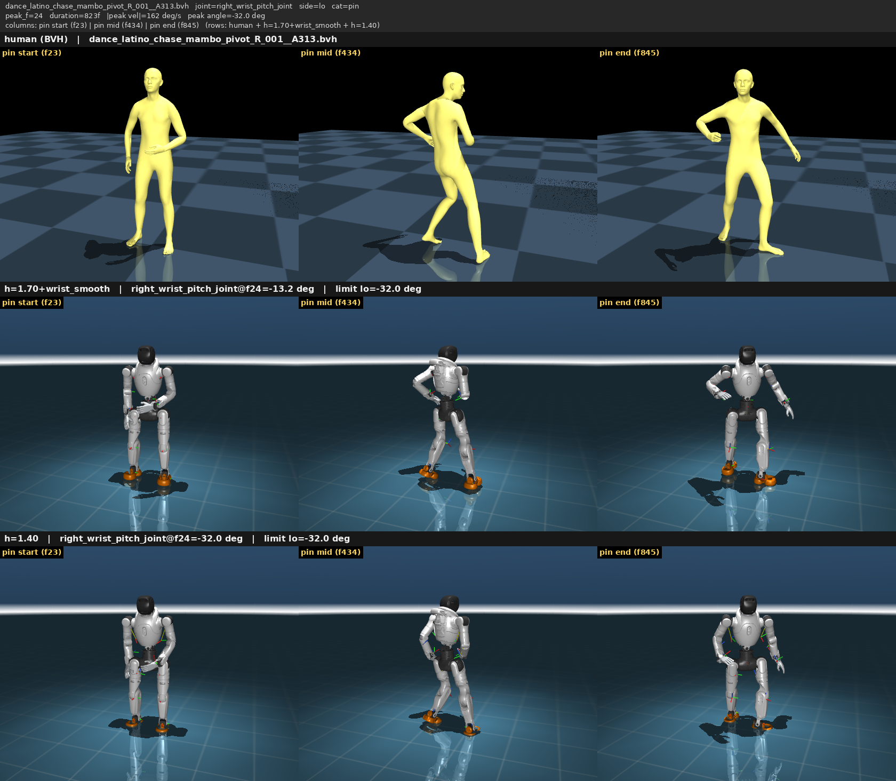

**#3 — `body_check_004__A444` :: right_wrist_pitch_joint @ f2003 (pin, angle@stop=-32.0° dur=3.73s)**

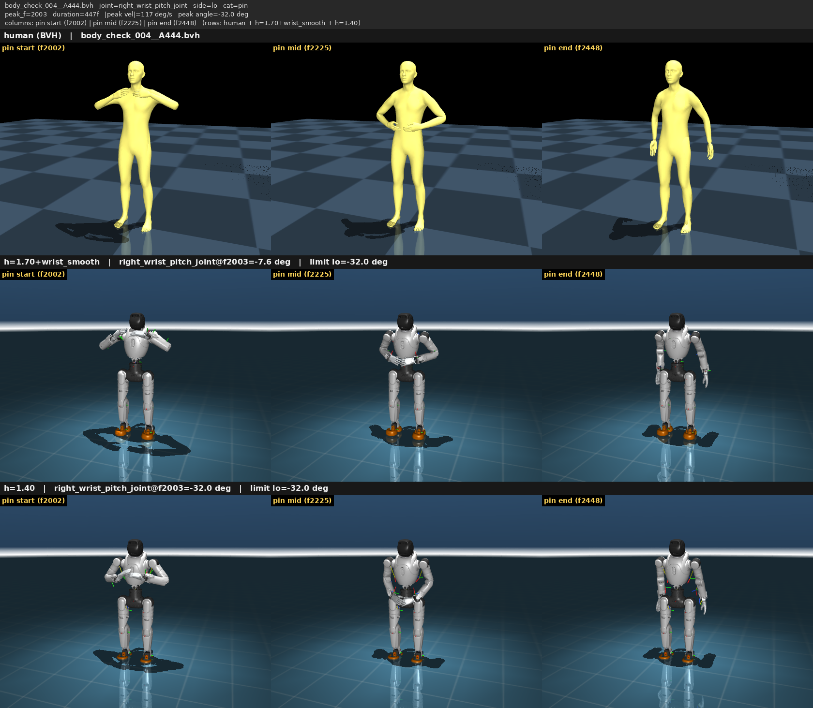

**#4 — `body_check_004__A444` :: left_wrist_pitch_joint @ f2020 (pin, angle@stop=-32.0° dur=3.61s)**

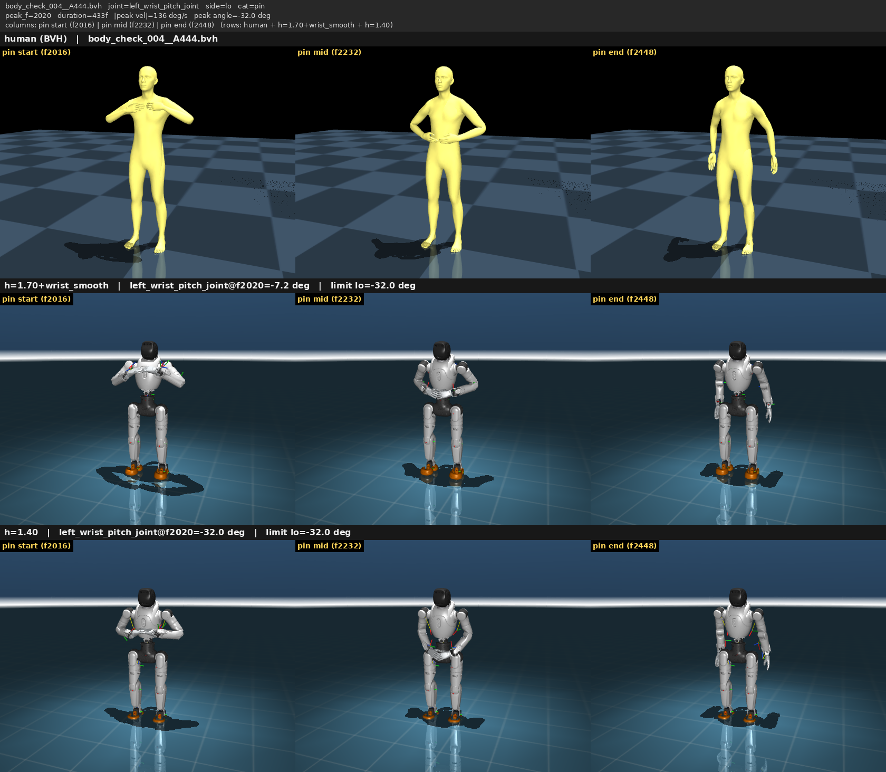

**#6 — `small_light_two_hands_walk_ff_loop_180_R_001__A505_M` :: left_wrist_pitch_joint @ f0 (pin, angle@stop=-32.0° dur=2.94s)**

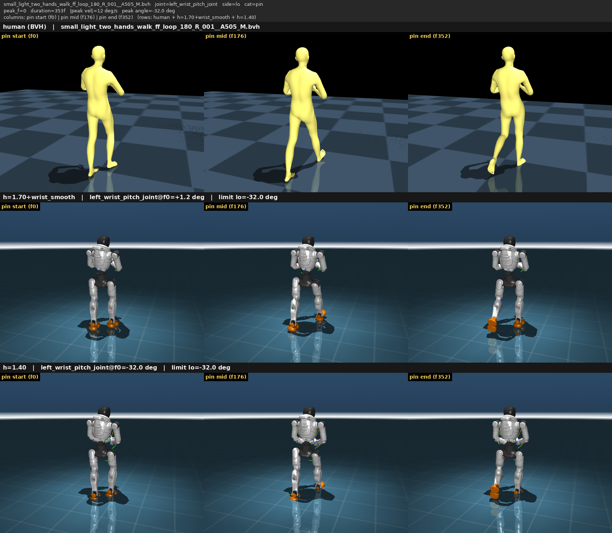

**#7 — `body_check_002__A492_M` :: right_wrist_pitch_joint @ f2186 (pin, angle@stop=-32.0° dur=2.62s)**

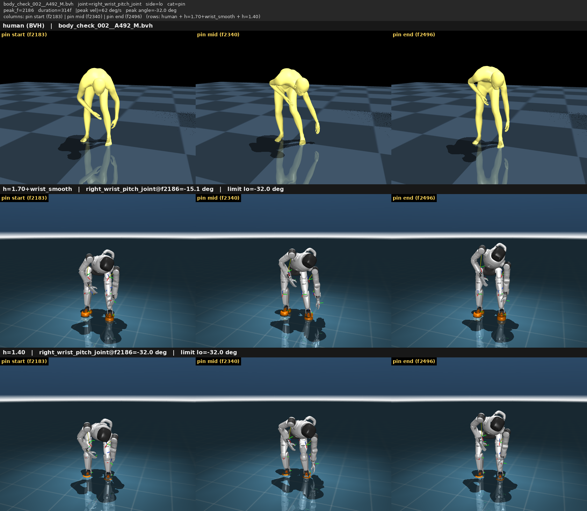

**#8 — `eat_hotdog_standing_fail_R_001__A456_M` :: left_wrist_pitch_joint @ f1167 (pin, angle@stop=-32.0° dur=2.60s)**

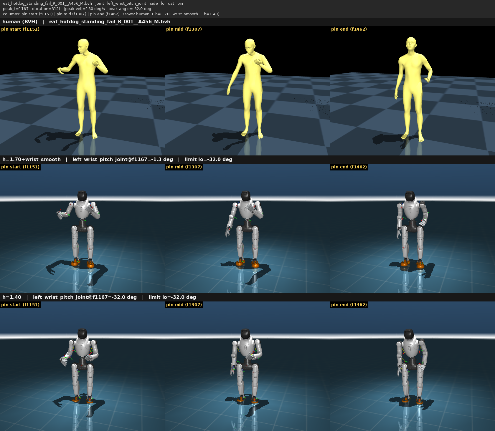

**#9 — `body_check_004__A444` :: right_wrist_pitch_joint @ f54 (pin, angle@stop=-32.0° dur=2.46s)**

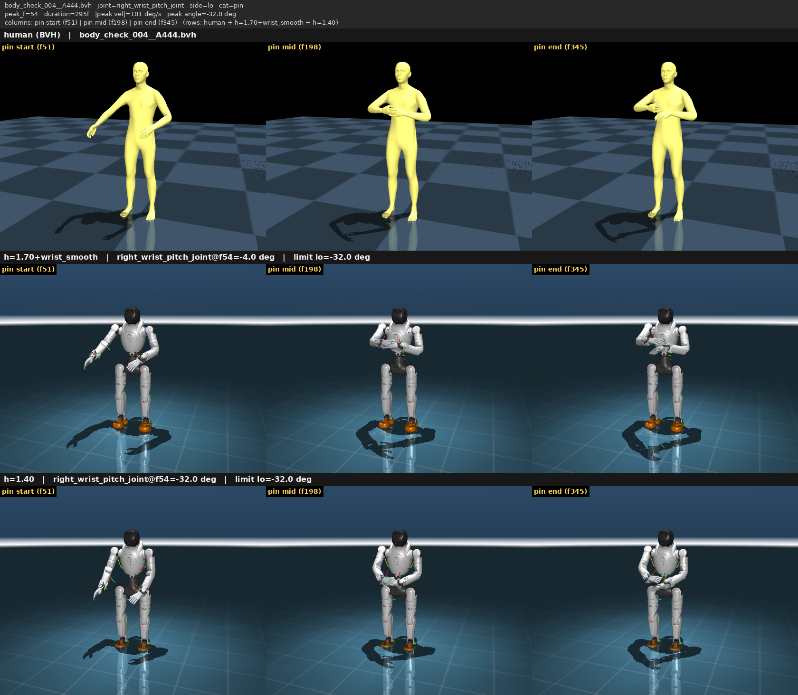

## Wrist — palm FORWARD/BACK BEND (wrist_roll) — flex / extend, −90° / +41° (asymmetric)

The asymmetric flex/extend DOF. Slams here are the classic wrist-flip basin hops.

| # | clip | joint | cat | start | end | peak frame | duration (s) | summary metric |
|---:|---|---|---|---:|---:|---:|---:|---:|
| 1 | `victory_dance_asarahe_180_R_004__A324` | right_wrist_roll_joint | slam | 720 | 727 | 721 | 0.07 | peak vel=-9192 deg/s |
| 2 | `dance_vouge_butterfly_step_180_R_fast_002__A319` | left_wrist_roll_joint | slam | 486 | 493 | 487 | 0.07 | peak vel=+2315 deg/s |
| 3 | `dance_vouge_butterfly_step_180_R_fast_002__A319` | left_wrist_roll_joint | slam | 365 | 381 | 366 | 0.14 | peak vel=+1885 deg/s |
| 4 | `dance_vouge_butterfly_step_180_R_fast_002__A319` | right_wrist_roll_joint | slam | 175 | 199 | 175 | 0.21 | peak vel=-1882 deg/s |
| 5 | `dance_vouge_butterfly_step_180_R_fast_002__A319` | left_wrist_roll_joint | slam | 425 | 437 | 425 | 0.11 | peak vel=+1847 deg/s |
| 6 | `dance_vouge_butterfly_step_180_R_fast_002__A319` | left_wrist_roll_joint | slam | 180 | 199 | 180 | 0.17 | peak vel=+1757 deg/s |
| 7 | `victory_dance_asarahe_180_R_004__A324` | left_wrist_roll_joint | slam | 807 | 816 | 808 | 0.08 | peak vel=-1573 deg/s |
| 8 | `dance_vouge_butterfly_step_180_R_fast_002__A319` | right_wrist_roll_joint | slam | 115 | 136 | 115 | 0.18 | peak vel=-1554 deg/s |
| 9 | `victory_dance_asarahe_180_R_004__A324` | right_wrist_roll_joint | slam | 771 | 778 | 771 | 0.07 | peak vel=+1530 deg/s |
| 10 | `dance_vouge_butterfly_step_180_R_fast_002__A319` | right_wrist_roll_joint | slam | 421 | 445 | 421 | 0.21 | peak vel=-1504 deg/s |

_Renders (rows: human / h=1.70+wrist_smooth / h=1.40). Click an image to expand._

**#1 — `victory_dance_asarahe_180_R_004__A324` :: right_wrist_roll_joint @ f721 (slam, peak vel=-9192 deg/s)**

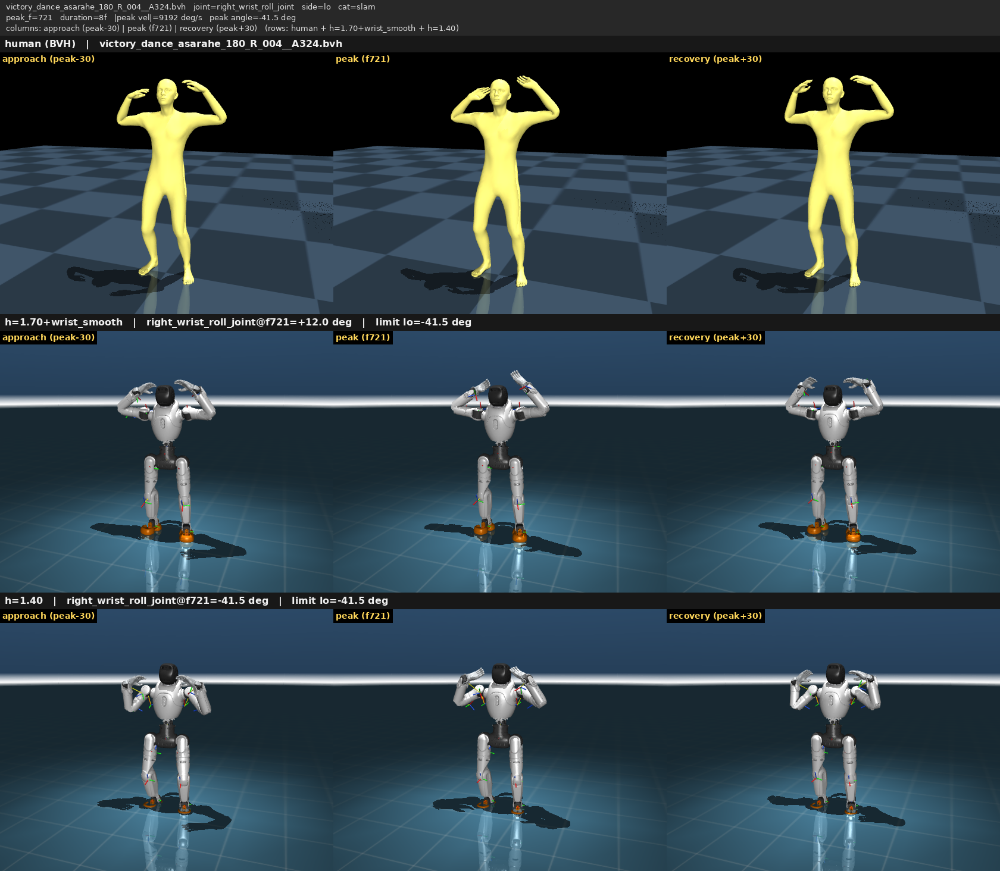

**#2 — `dance_vouge_butterfly_step_180_R_fast_002__A319` :: left_wrist_roll_joint @ f487 (slam, peak vel=+2315 deg/s)**

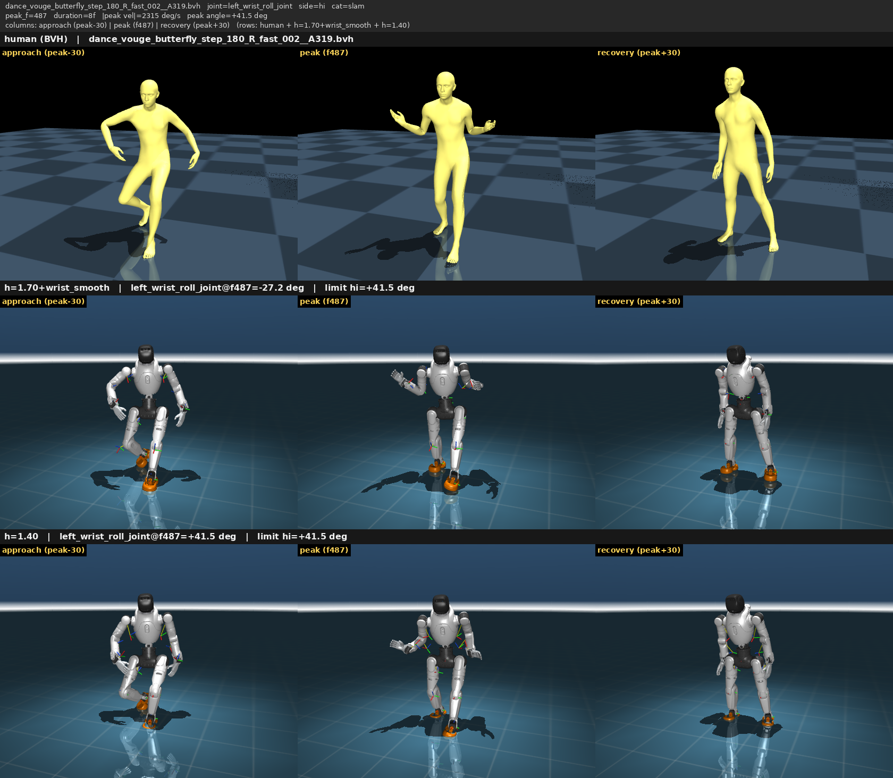

**#3 — `dance_vouge_butterfly_step_180_R_fast_002__A319` :: left_wrist_roll_joint @ f366 (slam, peak vel=+1885 deg/s)**

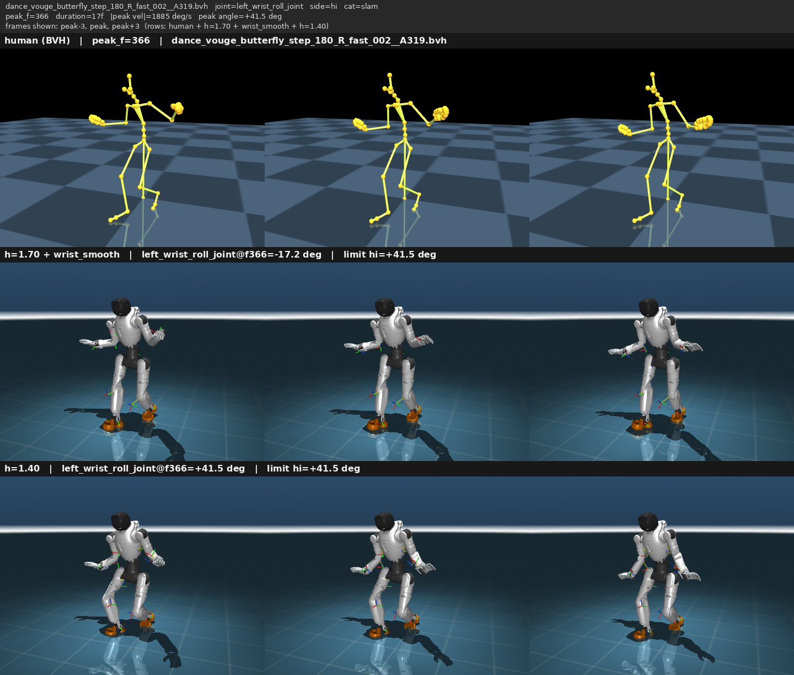

**#4 — `dance_vouge_butterfly_step_180_R_fast_002__A319` :: right_wrist_roll_joint @ f175 (slam, peak vel=-1882 deg/s)**

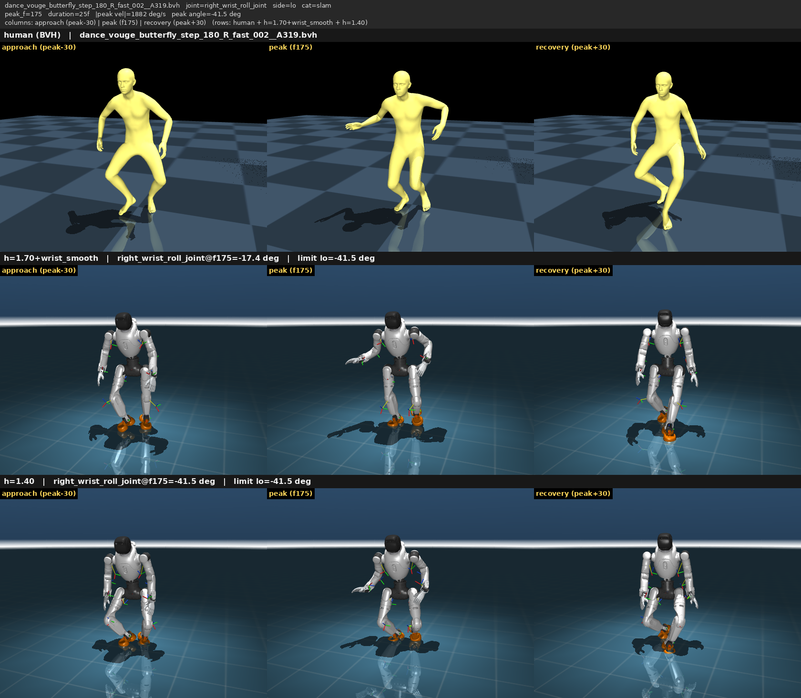

**#5 — `dance_vouge_butterfly_step_180_R_fast_002__A319` :: left_wrist_roll_joint @ f425 (slam, peak vel=+1847 deg/s)**

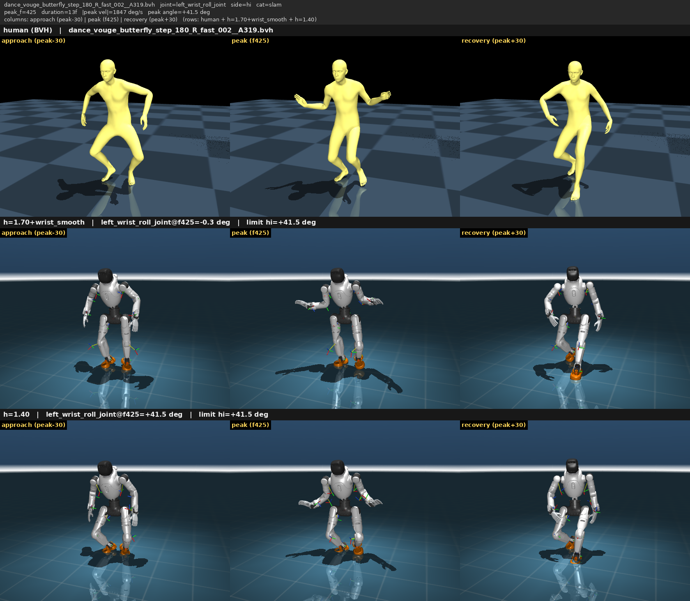

**#6 — `dance_vouge_butterfly_step_180_R_fast_002__A319` :: left_wrist_roll_joint @ f180 (slam, peak vel=+1757 deg/s)**

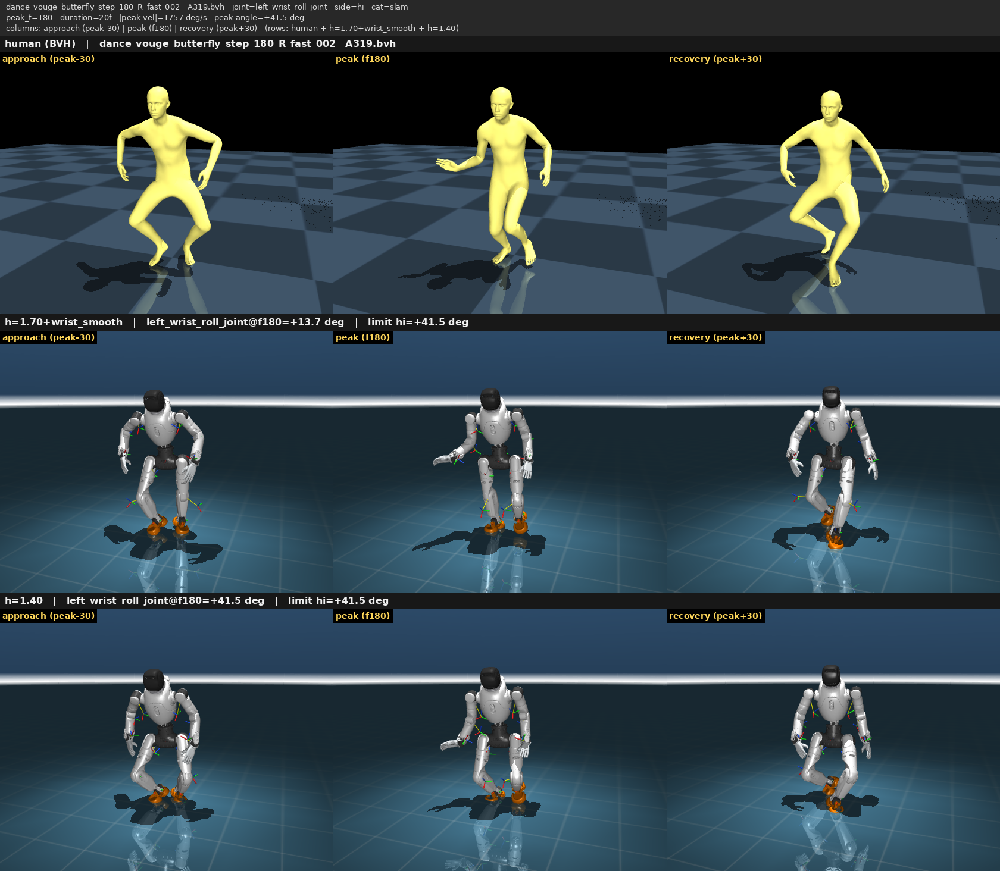

**#7 — `victory_dance_asarahe_180_R_004__A324` :: left_wrist_roll_joint @ f808 (slam, peak vel=-1573 deg/s)**

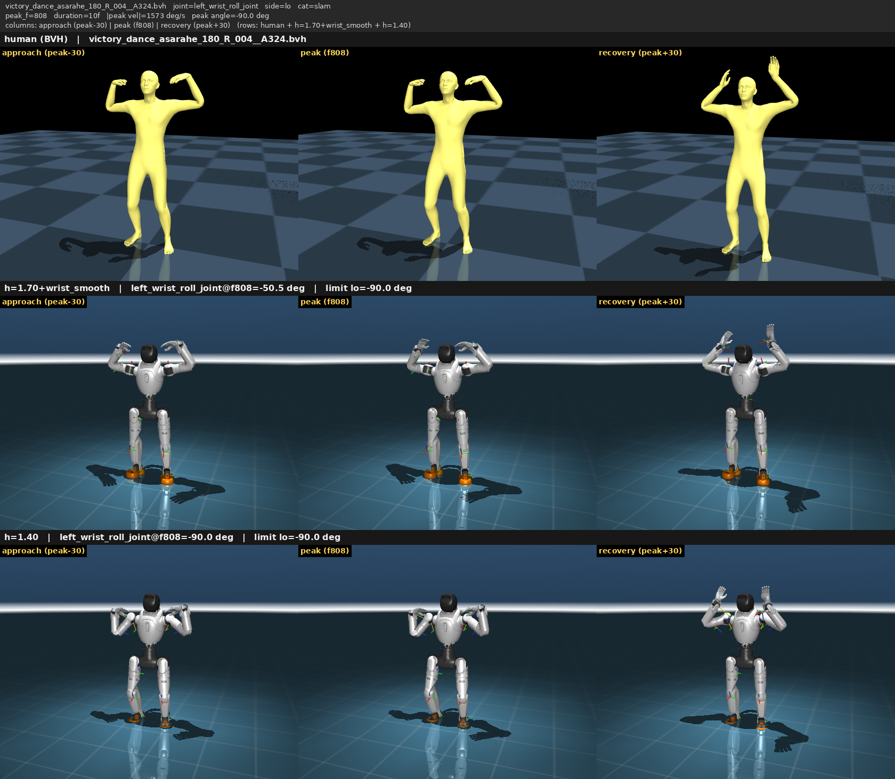

**#8 — `dance_vouge_butterfly_step_180_R_fast_002__A319` :: right_wrist_roll_joint @ f115 (slam, peak vel=-1554 deg/s)**

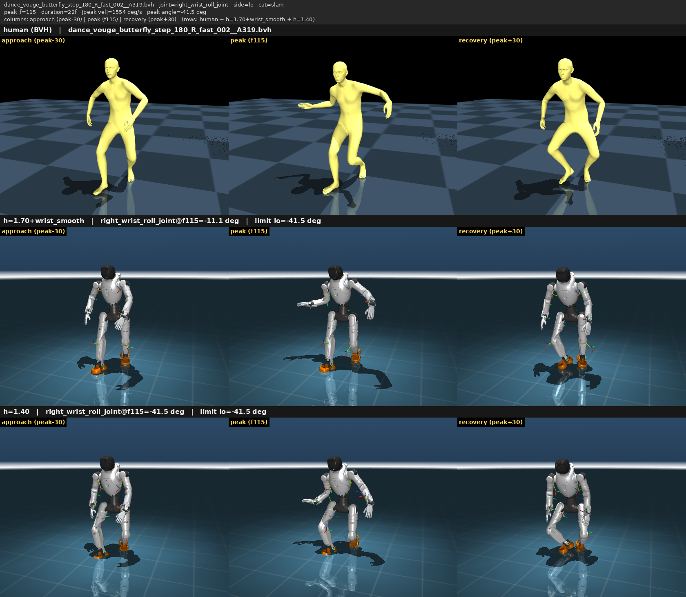

## Elbow (left_elbow_joint, right_elbow_joint)

Elbow against its limits. Most slams are basin hops on full extension.

| # | clip | joint | cat | start | end | peak frame | duration (s) | summary metric |
|---:|---|---|---|---:|---:|---:|---:|---:|
| 1 | `dance_retro_disco_finger_sequence_R_fast_002__A314` | left_elbow_joint | slam | 286 | 336 | 287 | 0.42 | peak vel=-11109 deg/s |
| 2 | `dance_retro_disco_finger_sequence_R_fast_002__A314` | right_elbow_joint | slam | 305 | 339 | 305 | 0.29 | peak vel=-8992 deg/s |
| 3 | `dance_retro_disco_finger_sequence_R_fast_002__A314` | left_elbow_joint | slam | 320 | 374 | 322 | 0.46 | peak vel=-4608 deg/s |
| 4 | `dance_retro_disco_finger_sequence_R_fast_002__A314` | left_elbow_joint | slam | 676 | 706 | 676 | 0.26 | peak vel=-4501 deg/s |
| 5 | `dance_retro_disco_finger_sequence_R_fast_002__A314` | left_elbow_joint | slam | 354 | 389 | 355 | 0.30 | peak vel=+4350 deg/s |
| 6 | `dance_retro_disco_finger_sequence_R_fast_002__A314` | right_elbow_joint | slam | 365 | 389 | 365 | 0.21 | peak vel=+3072 deg/s |
| 7 | `dance_retro_disco_finger_sequence_R_fast_002__A314` | right_elbow_joint | slam | 417 | 453 | 417 | 0.31 | peak vel=-2874 deg/s |
| 8 | `walk_forward_relax_003__A005` | left_elbow_joint | slam | 0 | 155 | 0 | 1.30 | peak vel=-1683 deg/s |
| 9 | `dance_retro_disco_finger_sequence_R_fast_002__A314` | right_elbow_joint | slam | 535 | 565 | 537 | 0.26 | peak vel=-1330 deg/s |
| 10 | `dance_retro_jazz_cross_step_180_R_001__A314` | right_elbow_joint | slam | 320 | 340 | 320 | 0.17 | peak vel=-1192 deg/s |

_Renders (rows: human / h=1.70+wrist_smooth / h=1.40). Click an image to expand._

**#1 — `dance_retro_disco_finger_sequence_R_fast_002__A314` :: left_elbow_joint @ f287 (slam, peak vel=-11109 deg/s)**

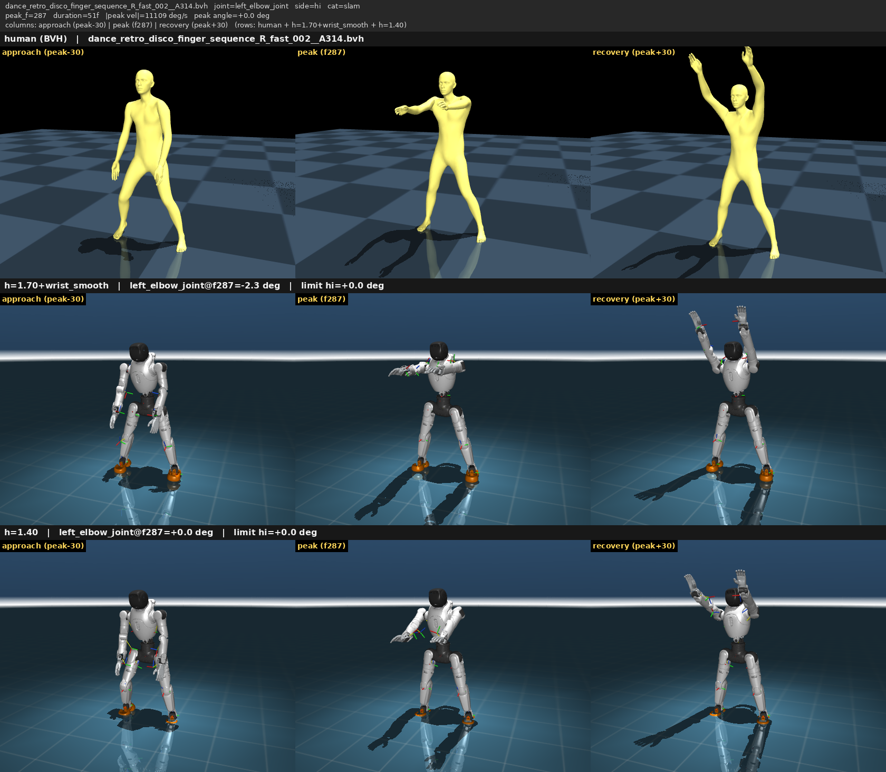

**#2 — `dance_retro_disco_finger_sequence_R_fast_002__A314` :: right_elbow_joint @ f305 (slam, peak vel=-8992 deg/s)**

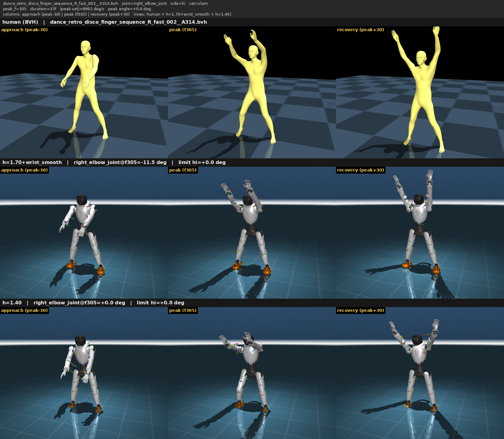

**#3 — `dance_retro_disco_finger_sequence_R_fast_002__A314` :: left_elbow_joint @ f322 (slam, peak vel=-4608 deg/s)**

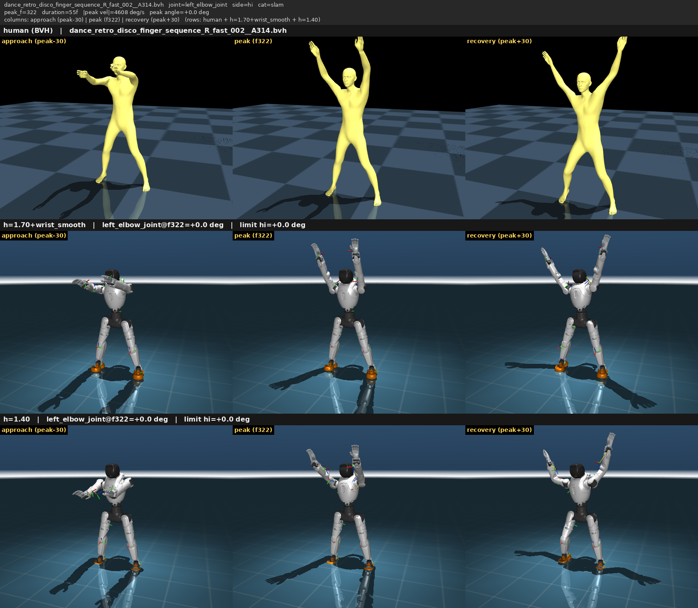

**#4 — `dance_retro_disco_finger_sequence_R_fast_002__A314` :: left_elbow_joint @ f676 (slam, peak vel=-4501 deg/s)**

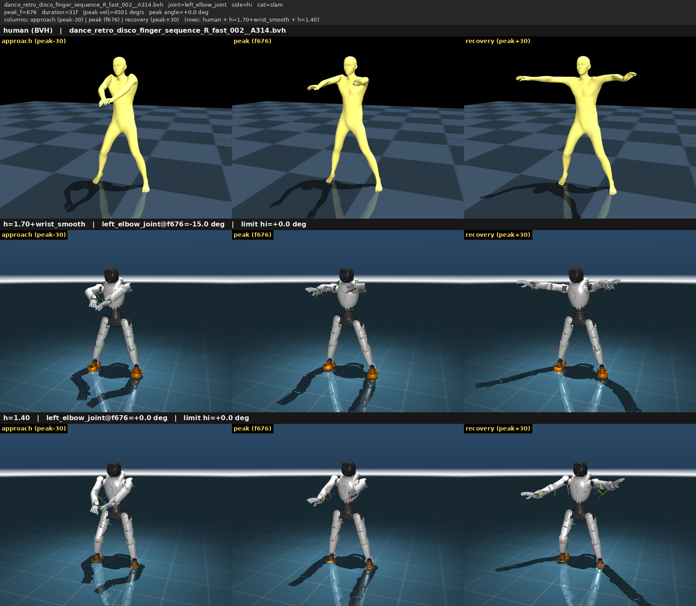

**#5 — `dance_retro_disco_finger_sequence_R_fast_002__A314` :: left_elbow_joint @ f355 (slam, peak vel=+4350 deg/s)**

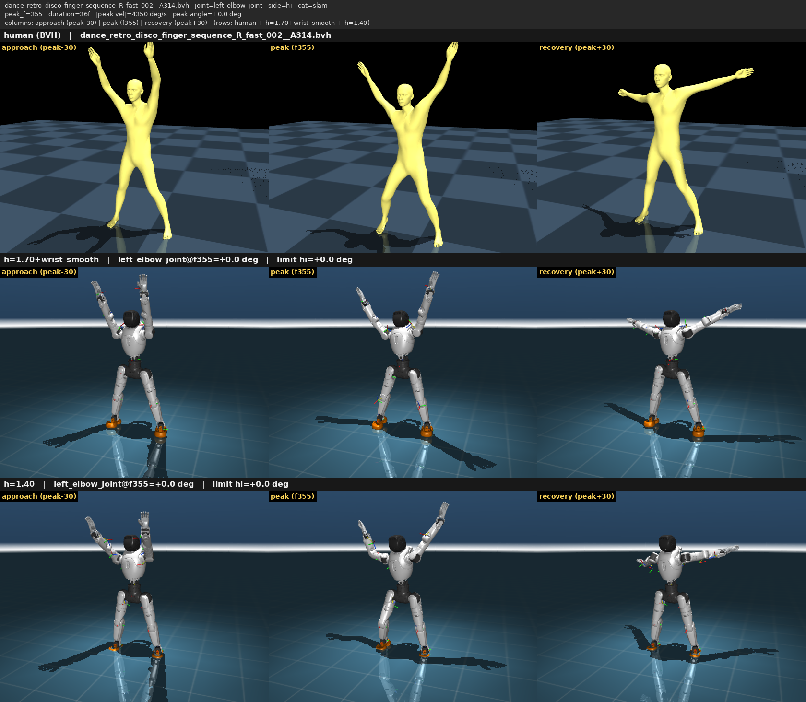

**#6 — `dance_retro_disco_finger_sequence_R_fast_002__A314` :: right_elbow_joint @ f365 (slam, peak vel=+3072 deg/s)**

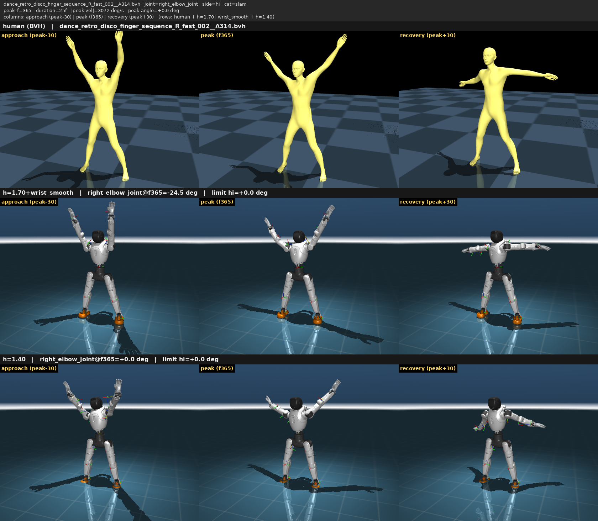

**#7 — `dance_retro_disco_finger_sequence_R_fast_002__A314` :: right_elbow_joint @ f417 (slam, peak vel=-2874 deg/s)**

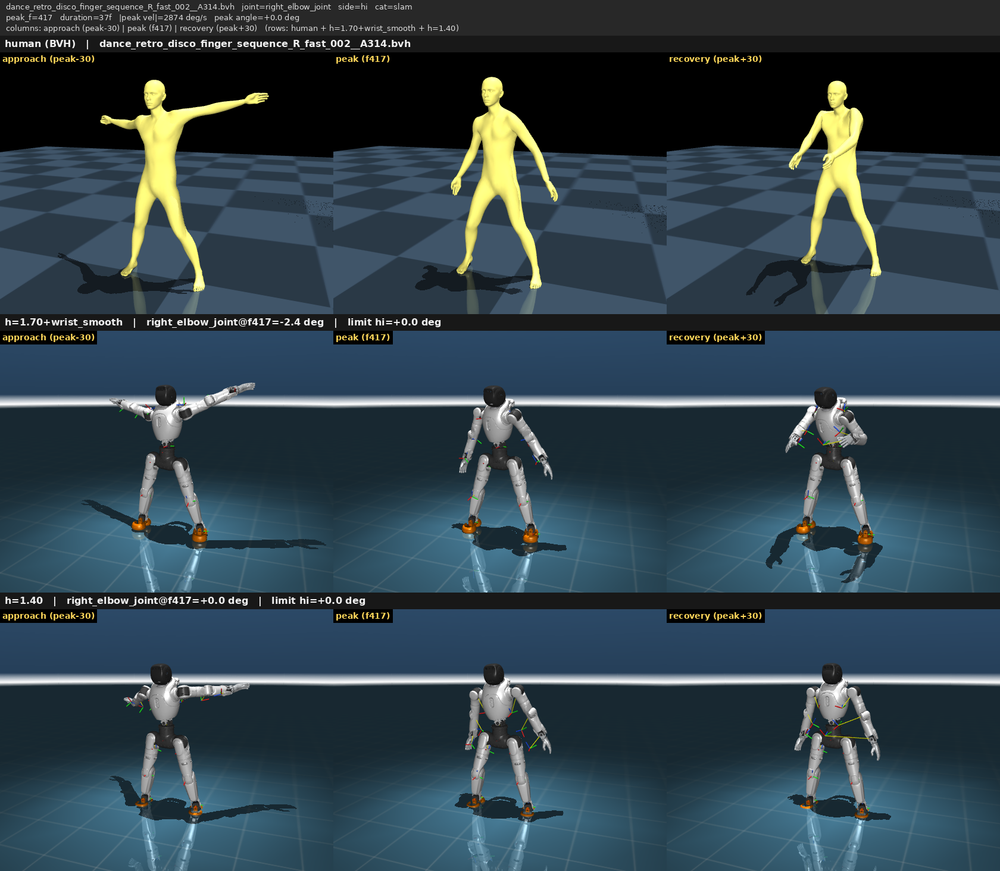

**#8 — `walk_forward_relax_003__A005` :: left_elbow_joint @ f0 (slam, peak vel=-1683 deg/s)**

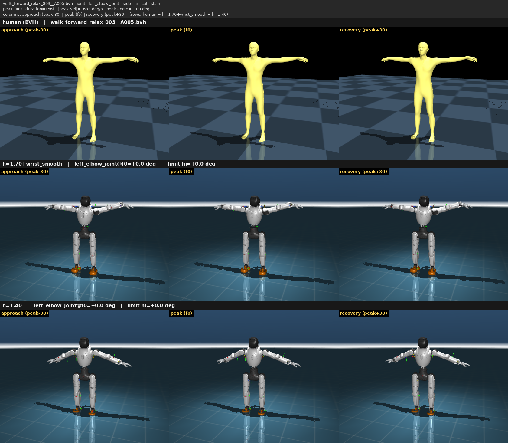

**#10 — `dance_retro_jazz_cross_step_180_R_001__A314` :: right_elbow_joint @ f320 (slam, peak vel=-1192 deg/s)**

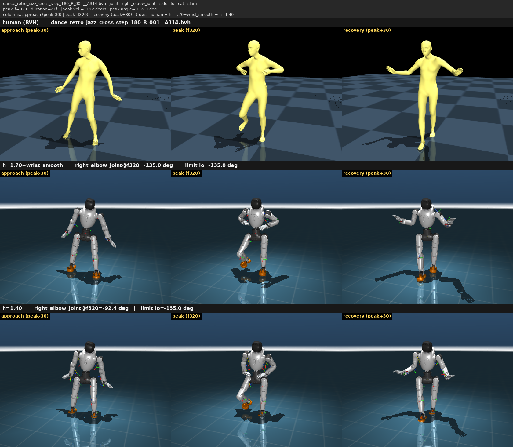

## Shoulder (shoulder_roll / shoulder_yaw / shoulder_pitch)

Shoulder workspace bound; mostly the asymmetric shoulder_roll hitting its hardware stop.

| # | clip | joint | cat | start | end | peak frame | duration (s) | summary metric |
|---:|---|---|---|---:|---:|---:|---:|---:|
| 1 | `dance_retro_disco_finger_sequence_R_fast_002__A314` | left_shoulder_yaw_joint | slam | 340 | 372 | 342 | 0.28 | peak vel=+1771 deg/s |
| 2 | `dance_retro_disco_finger_sequence_R_fast_002__A314` | right_shoulder_pitch_joint | slam | 454 | 454 | 454 | 0.01 | peak vel=+1043 deg/s |
| 3 | `body_check_001__A381_M` | left_shoulder_roll_joint | slam | 2203 | 2668 | 2205 | 3.88 | peak vel=+842 deg/s |
| 4 | `dance_retro_disco_finger_sequence_R_fast_002__A314` | left_shoulder_pitch_joint | slam | 452 | 454 | 454 | 0.03 | peak vel=+813 deg/s |
| 5 | `dance_retro_disco_finger_sequence_R_fast_002__A314` | left_shoulder_yaw_joint | slam | 414 | 515 | 414 | 0.85 | peak vel=-735 deg/s |
| 6 | `dance_retro_disco_finger_sequence_R_fast_002__A314` | right_shoulder_roll_joint | slam | 613 | 683 | 614 | 0.59 | peak vel=+634 deg/s |
| 7 | `dance_vouge_butterfly_step_180_R_fast_002__A319` | left_shoulder_roll_joint | slam | 479 | 541 | 479 | 0.53 | peak vel=-620 deg/s |
| 8 | `dance_vouge_butterfly_step_180_R_fast_002__A319` | right_shoulder_roll_joint | slam | 177 | 202 | 177 | 0.22 | peak vel=+592 deg/s |
| 9 | `body_check_002__A492_M` | right_shoulder_roll_joint | slam | 2720 | 2839 | 2721 | 1.00 | peak vel=-560 deg/s |
| 10 | `dance_vouge_butterfly_step_180_R_fast_002__A319` | right_shoulder_roll_joint | slam | 301 | 323 | 301 | 0.19 | peak vel=+540 deg/s |

_Renders (rows: human / h=1.70+wrist_smooth / h=1.40). Click an image to expand._

**#1 — `dance_retro_disco_finger_sequence_R_fast_002__A314` :: left_shoulder_yaw_joint @ f342 (slam, peak vel=+1771 deg/s)**

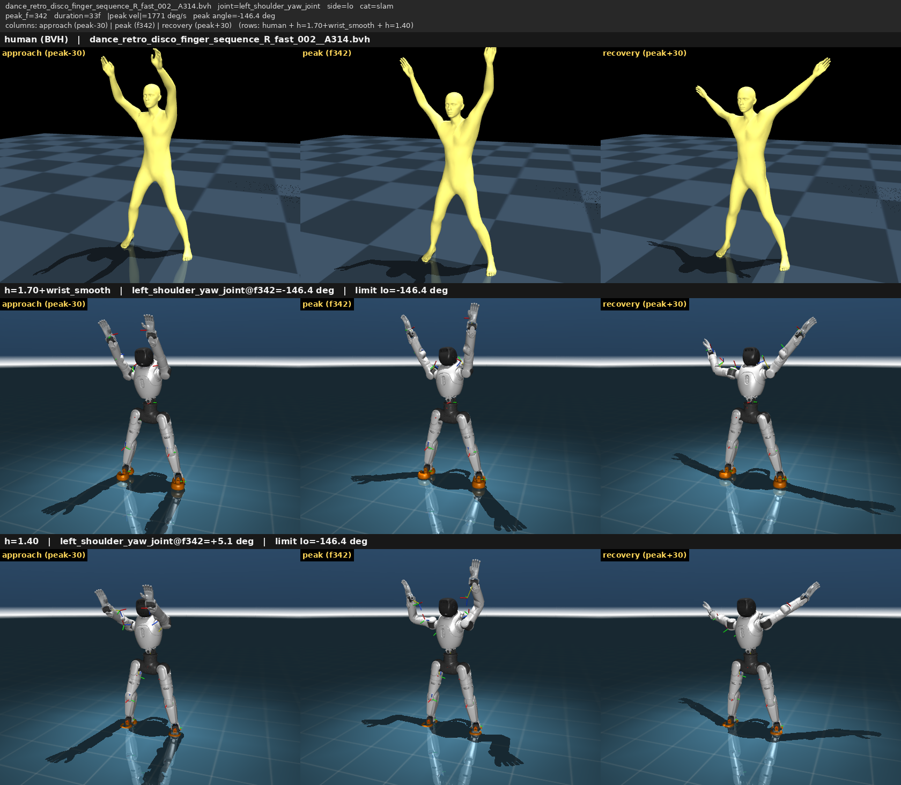

**#2 — `dance_retro_disco_finger_sequence_R_fast_002__A314` :: right_shoulder_pitch_joint @ f454 (slam, peak vel=+1043 deg/s)**

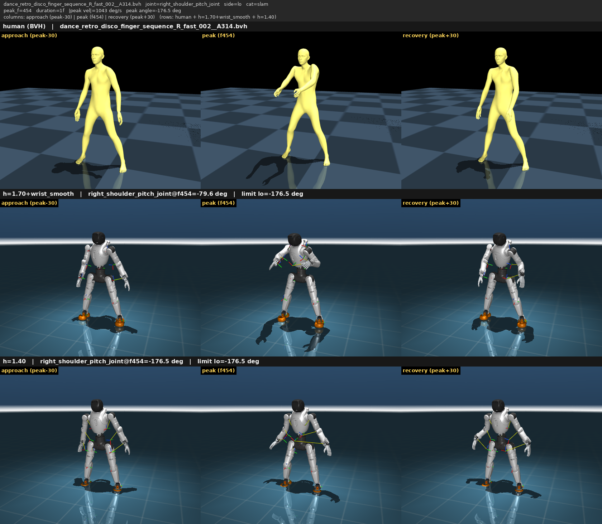

**#3 — `body_check_001__A381_M` :: left_shoulder_roll_joint @ f2205 (slam, peak vel=+842 deg/s)**

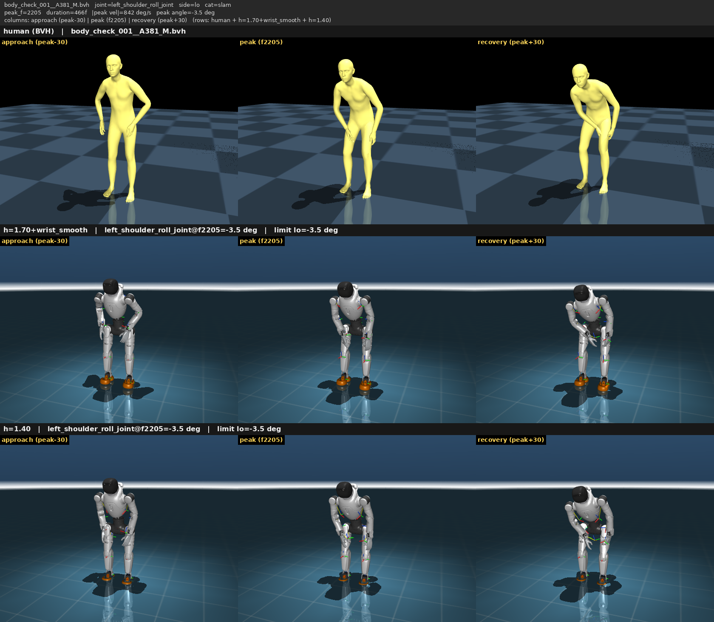

**#4 — `dance_retro_disco_finger_sequence_R_fast_002__A314` :: left_shoulder_pitch_joint @ f454 (slam, peak vel=+813 deg/s)**

**#5 — `dance_retro_disco_finger_sequence_R_fast_002__A314` :: left_shoulder_yaw_joint @ f414 (slam, peak vel=-735 deg/s)**

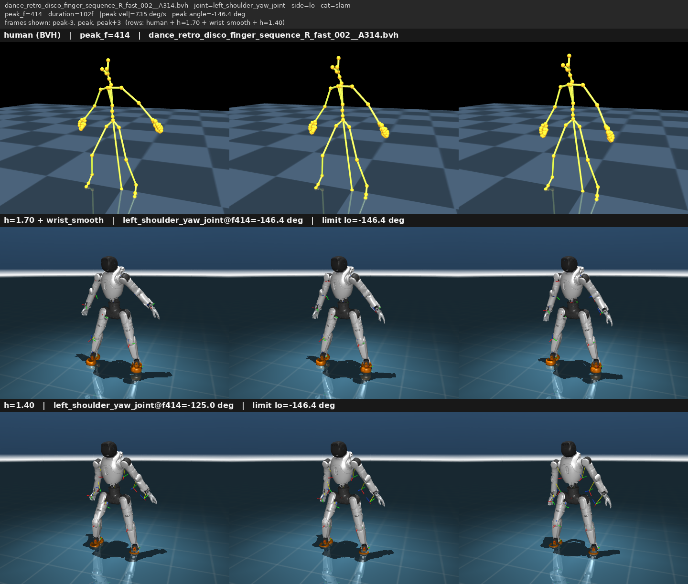

**#6 — `dance_retro_disco_finger_sequence_R_fast_002__A314` :: right_shoulder_roll_joint @ f614 (slam, peak vel=+634 deg/s)**

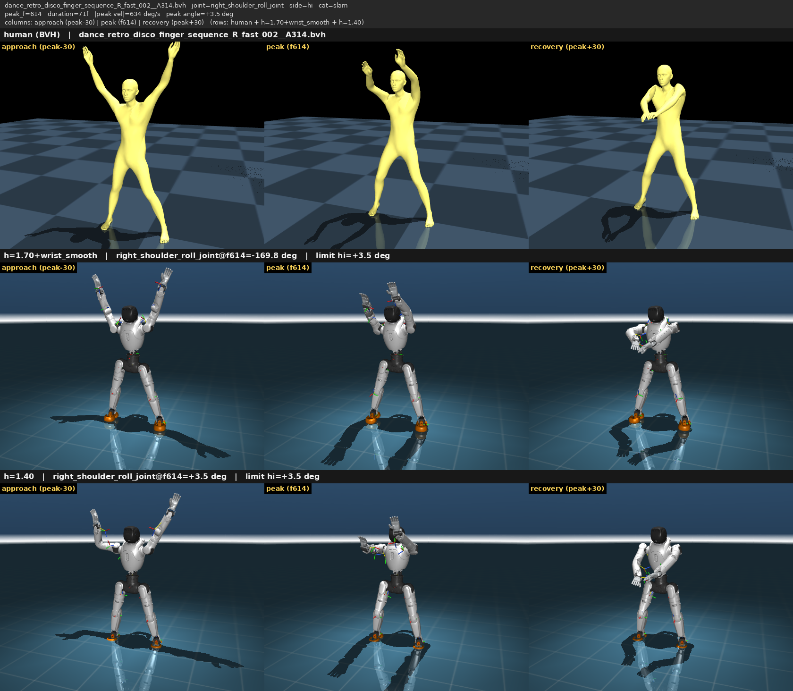

**#7 — `dance_vouge_butterfly_step_180_R_fast_002__A319` :: left_shoulder_roll_joint @ f479 (slam, peak vel=-620 deg/s)**

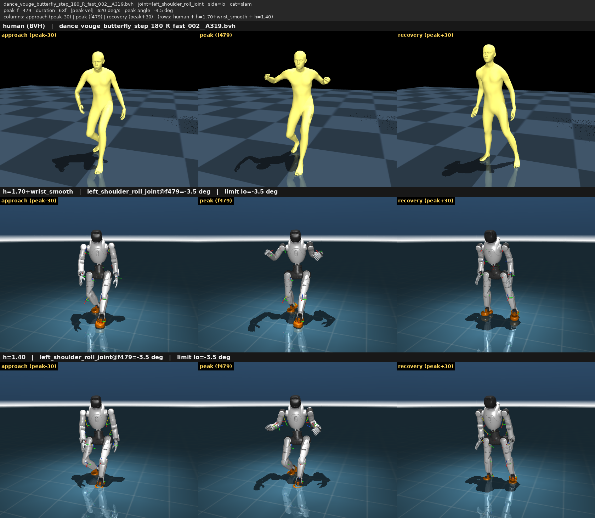

**#8 — `dance_vouge_butterfly_step_180_R_fast_002__A319` :: right_shoulder_roll_joint @ f177 (slam, peak vel=+592 deg/s)**

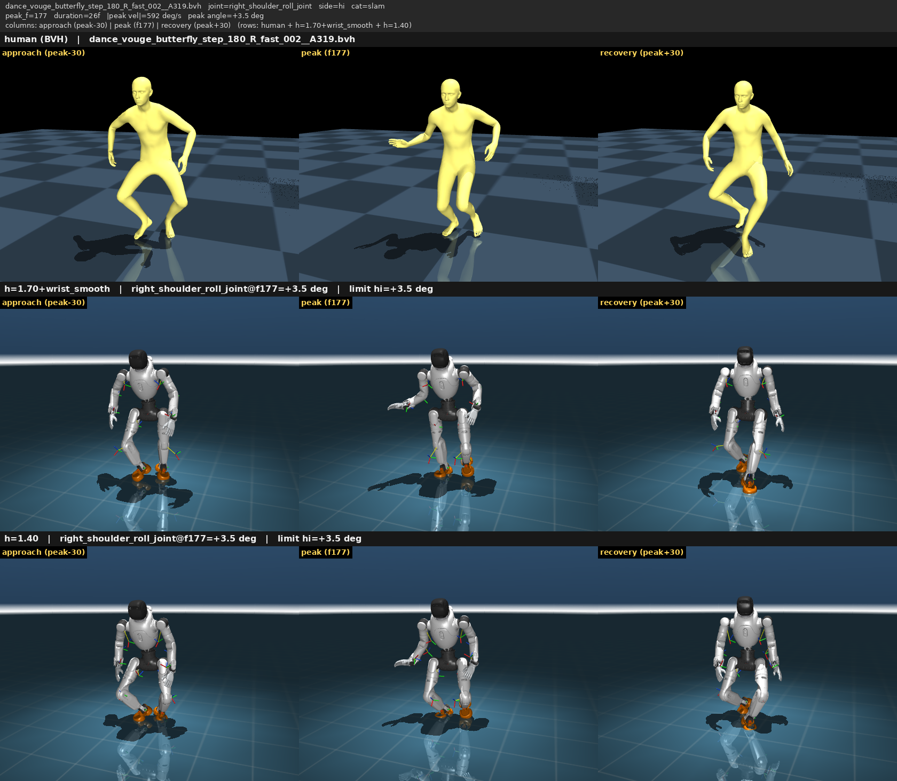

---

## Appendix A — Events per joint

| joint | h=1.70+wrist_smooth slam | h=1.40 slam | h=1.70+wrist_smooth pin | h=1.40 pin | h=1.70+wrist_smooth twist | h=1.40 twist |
|---|---:|---:|---:|---:|---:|---:|
| left_ankle_pitch_joint | 51 | 6 | 13 | 9 | 0 | 0 |
| left_ankle_roll_joint | 53 | 52 | 51 | 28 | 0 | 0 |
| left_elbow_joint | 27 | 35 | 14 | 12 | 0 | 0 |
| left_hip_roll_joint | 4 | 4 | 16 | 14 | 0 | 0 |
| left_knee_joint | 3 | 1 | 1 | 1 | 0 | 0 |
| left_shoulder_pitch_joint | 0 | 1 | 0 | 0 | 0 | 0 |
| left_shoulder_roll_joint | 25 | 26 | 2 | 2 | 0 | 0 |
| left_shoulder_yaw_joint | 2 | 0 | 0 | 0 | 0 | 0 |
| left_wrist_pitch_joint | 0 | 33 | 0 | 48 | 0 | 0 |
| left_wrist_roll_joint | 0 | 54 | 0 | 25 | 0 | 0 |
| left_wrist_yaw_joint | 0 | 0 | 0 | 0 | 24 | 52 |
| right_ankle_pitch_joint | 78 | 8 | 16 | 8 | 0 | 0 |
| right_ankle_roll_joint | 85 | 83 | 36 | 46 | 0 | 0 |
| right_elbow_joint | 27 | 35 | 19 | 5 | 0 | 0 |
| right_hip_roll_joint | 5 | 4 | 8 | 10 | 0 | 0 |
| right_knee_joint | 5 | 5 | 1 | 2 | 0 | 0 |
| right_shoulder_pitch_joint | 0 | 1 | 0 | 0 | 0 | 0 |
| right_shoulder_roll_joint | 34 | 26 | 1 | 0 | 0 | 0 |
| right_wrist_pitch_joint | 0 | 49 | 0 | 53 | 0 | 0 |
| right_wrist_roll_joint | 0 | 63 | 0 | 39 | 0 | 0 |
| right_wrist_yaw_joint | 0 | 0 | 0 | 0 | 14 | 58 |

## Appendix B — Events per joint group

| group | h=1.70+wrist_smooth slam | h=1.40 slam | h=1.70+wrist_smooth pin | h=1.40 pin | h=1.70+wrist_smooth twist | h=1.40 twist |
|---|---:|---:|---:|---:|---:|---:|
| hip | 9 | 8 | 24 | 24 | 0 | 0 |
| knee | 8 | 6 | 2 | 3 | 0 | 0 |
| ankle | 267 | 149 | 116 | 91 | 0 | 0 |
| waist | 0 | 0 | 0 | 0 | 0 | 0 |
| shoulder | 61 | 54 | 3 | 2 | 0 | 0 |
| elbow | 54 | 70 | 33 | 17 | 0 | 0 |
| wrist | 0 | 199 | 0 | 165 | 38 | 110 |
| head | 0 | 0 | 0 | 0 | 0 | 0 |

