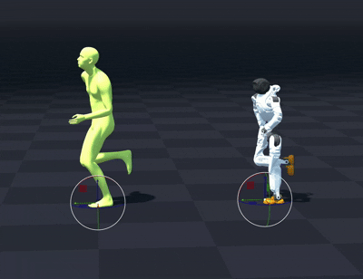
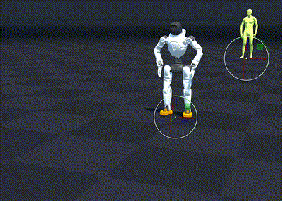
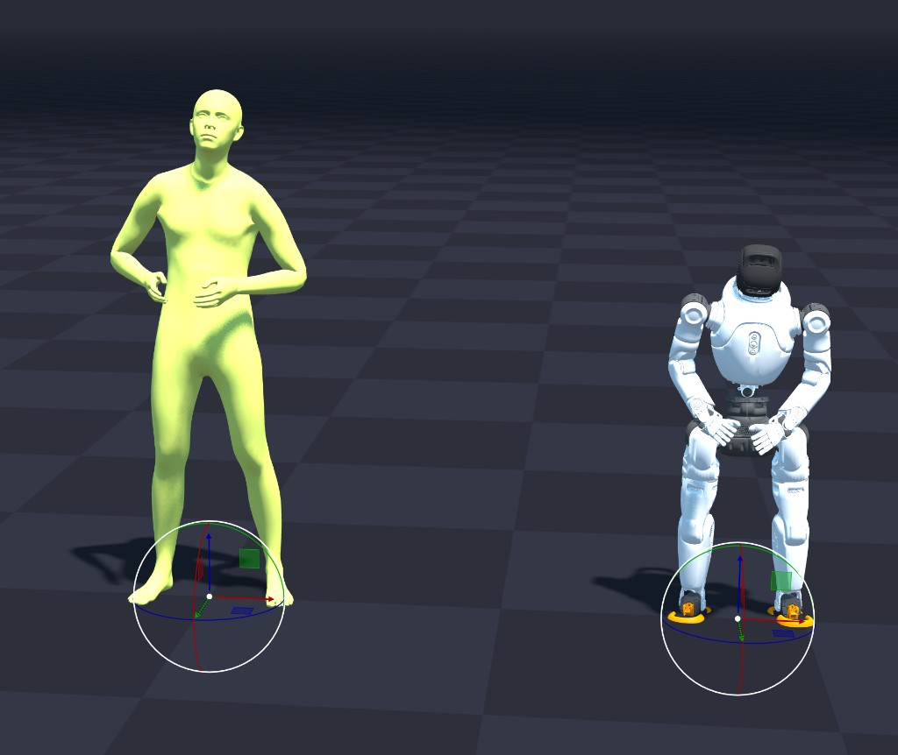
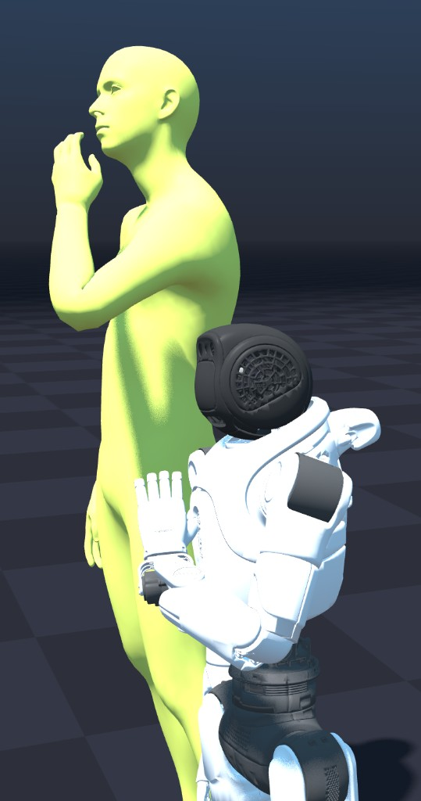
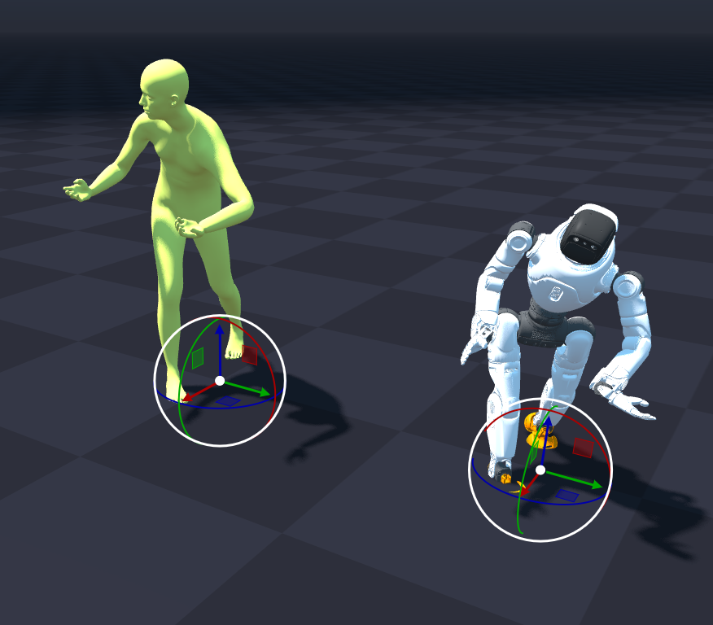

# Agibot X2 Ultra -- SOMA Retargeter Integration

## Overview

This directory contains the retargeting configuration for the **Agibot X2 Ultra** (31-DOF humanoid) as a target robot in the SOMA Retargeter pipeline. The X2 Ultra joins the Unitree G1 (29-DOF) as a supported retarget target.

## Files

| File | Purpose |
|------|---------|
| `soma_to_x2_ultra_retargeter_config.json` | IK map, weights, and pipeline settings |
| `soma_to_x2_ultra_scaler_config.json` | Human-to-robot scaling, joint offsets, and joint hierarchy |
| `x2_ultra_feet_stabilizer_config.json` | Foot contact effectors for ground stabilization |

## Result

<table>
<tr>
<td align="center"><b>Dance 1</b></td>
<td align="center"><b>Dance 2</b></td>
</tr>
<tr>
<td></td>
<td></td>
</tr>
</table>

## Arm Retargeting: Challenges and Solution

### Problem

When initially porting the G1 configuration to the X2 Ultra, the retargeted arm motion was completely wrong -- arms flipped over the robot's head instead of swinging naturally at its sides during a walking motion.

### Root Cause Analysis

The X2 Ultra and G1 have different arm kinematic structures. While the **shoulder joints** share the same axis conventions (pitch=Y, roll=X, yaw=Z) and the **leg chains** are structurally identical between both robots, two critical differences exist in the arm chain:

1. **Elbow joint axis**: G1 uses an **X-axis** elbow, while X2 uses a **Y-axis** elbow.
2. **Wrist chain order**: G1 orders its wrist joints as roll-pitch-yaw; X2 orders them as yaw-pitch-roll.

The SOMA retargeter uses weighted IK objectives for both position and rotation matching. The G1 configuration assigns high rotation weights to the forearm (`r_weight: 1.0`) and hand (`r_weight: 1.2`) effectors. These rotation targets encode world-frame orientations calibrated for G1's X-axis elbow.

When the same rotation targets are applied to the X2's Y-axis elbow, the IK solver cannot achieve the requested orientation through normal joint configurations. Instead, it finds a solution by driving the shoulder pitch joint to its extreme limit (~-3 radians), flipping the entire arm over the head -- a valid solution from the solver's perspective that minimizes rotation error but produces physically nonsensical motion.

### Debugging Approach

1. **Visual comparison**: Launched MuJoCo viewer (fixed base, no gravity) alongside the SOMA viewer to interactively explore joint limits and compare against retargeted output.
2. **Joint limit verification**: Confirmed that Newton's IK operates with correct joint limits by reading them directly from MuJoCo (not through Newton's body-indexed arrays, which have an off-by-one due to free joint coordinate vs DOF indexing).
3. **Axis comparison**: Systematically compared all joint axes and limits between G1 and X2 from MuJoCo ground truth, identifying the elbow axis difference as the structural root cause.
4. **Shoulder pitch tracing**: Verified in MuJoCo that the shoulder pitch range [-3.08, 2.04] rad allows the arm to go fully over the head at the negative extreme -- exactly matching the SOMA retarget's erroneous output.

### Solution

Reduced the IK rotation weights for forearm and hand effectors in `soma_to_x2_ultra_retargeter_config.json`:

| Effector | G1 `r_weight` | X2 `r_weight` |
|----------|---------------|---------------|
| LeftForeArm | 1.0 | 0.1 |
| LeftHand | 1.2 | 0.1 |
| RightForeArm | 1.0 | 0.1 |
| RightHand | 1.2 | 0.1 |

With reduced rotation weights, the position objectives dominate the arm IK. Since position tracking is axis-agnostic (it only cares about endpoint locations, not body-frame orientations), the solver finds natural arm configurations regardless of the elbow axis convention. The shoulder and arm position weights (`t_weight: 1.5` and `t_weight: 1.0`) remain unchanged and provide accurate arm tracking.

### Key Takeaway

When onboarding a new robot with different joint axis conventions, the IK rotation weights must be tuned per-robot. High rotation weights that work for one kinematic structure can cause catastrophic IK failures on another, even when the robots are superficially similar humanoids. Position-based tracking is more robust across different kinematic chains.

## Wrist Offset Tuning

### Problem

After fixing arm retargeting, the X2 Ultra's wrist joints were stuck at their physical limits during most of the motion. Both wrists appeared bent backward or locked in unnatural poses.

### Root Cause

The X2 Ultra has much tighter wrist joint limits than the G1:

| Joint | G1 range | X2 range |
|-------|----------|----------|
| Wrist pitch | ±92.5° | ±32° |
| Wrist roll | ±45° | ±28° |

The `joint_offsets` for `LeftHand` and `RightHand` in `soma_to_x2_ultra_scaler_config.json` were copied from the G1 configuration. These offsets define the transform from SOMA joint frames to robot link frames. Since the G1 offsets assumed wider wrist ranges, they placed the X2's neutral wrist pose outside its physical limits, causing the `JointLimitClamper` to hard-clamp the joints every frame.

### Debugging Approach

1. **CSV analysis**: Exported retargeted joint data and plotted human (BVH) vs robot (CSV) wrist positions, confirming 100% limit saturation on wrist pitch and roll.
2. **Empirical axis sweep**: Systematically applied large Euler rotations (±30° to ±90°) on individual axes of the Hand offset quaternion and observed which robot wrist joints responded. This revealed the mapping: Y-rotation in the offset controls robot wrist pitch, X-rotation controls wrist roll.
3. **Automated optimization was attempted** (`scipy.optimize.differential_evolution`) but small offset changes could not overcome the hard clamping, and numerically optimal solutions often looked visually unnatural.

### Solution

Applied targeted Euler corrections on top of the original G1 Hand offset quaternions to center the neutral wrist pose within X2's tighter limits:

- **LeftHand**: Y (pitch) = -55°, X (roll) = +80° applied on top of G1 offset
- **RightHand**: Y (pitch) = -55°, X (roll) = +80° applied on top of G1 offset

This preserved the natural orientation of the G1 offsets while shifting the operating point into X2's valid range.

## 2026 Re-tuning: Hip Twist, Wrist Alignment, and Arm-in-Hips

### Symptoms

Three regressions surfaced when reviewing the reference BVH
(`soma_uniform/220713/walk_forward_loop_001__A021.bvh`) against the
committed X2 retarget:

1. **Hips twisted unnaturally** during normal walking -- the pelvis yaw-wobbled far more than the human source.
2. **Wrists bent forward** roughly +20° even when the human hands were straight along the forearm. The arms looked like they were "reaching forward" instead of swinging at the sides.
3. **Hands buried in the hips** -- during the swing phase of the walk, the X2 forearm would rotate across the body and the hand mesh would intersect the pelvis.

### Diagnosis

- **Hips**: `model_height = 1.70` sized the IK targets for a 1.70 m human, but X2 Ultra is functionally ~1.40 m tall (standing pelvis at ~0.68 m, head at ~1.40 m). The oversized targets made the IK over-rotate hip yaw and roll chasing positions the short robot could not reach. With `model_height = 1.40`, `left_hip_yaw_joint` std drops from 11.0° to 4.7° and `waist_yaw_joint` follows suit.
- **Wrist pitch (forward bend)**: After the height fix, `wrist_pitch` was pinned at +22°/+19° on this walk clip. The pre-2026 wrist offset quaternions had been tuned at `model_height=1.70` and did not transfer cleanly. Per-axis sweeps revealed that a same-sign (no-mirror) Y rotation on the `LeftHand` and `RightHand` offset quaternions shifts both wrist_pitch joints together.
- **Hands-in-hips**: X2's `shoulder_roll` joint is hardware-asymmetric -- only **±3.5°** of inward travel before saturating (full range `[-3.5°, +171.5°]` on left, `[-171.5°, +3.5°]` on right). When the high `LeftHand.t_weight = 2.0` insisted on tracking the human's hand position exactly, the IK was forced to compensate via `shoulder_yaw` (mean −58° on left, +58° on right) and elbow flexion (−28° each). That combination rotates the forearm-bending plane inward across the body, so the hand ends up inside the pelvis silhouette.

### Solution

Three changes in `soma_to_x2_ultra_retargeter_config.json` and one in
`soma_to_x2_ultra_scaler_config.json`:

| File | Key | Was | Now | Why |
|------|-----|----:|----:|-----|
| `retargeter_config.json` | `model_height` | 1.70 | **1.40** | matches actual robot height; fixes hip yaw twist |
| `retargeter_config.json` | `LeftHand.t_weight` | 2.0 | **1.0** | softens the IK pull on the wrist so the solver doesn't twist `shoulder_yaw` to compensate for the saturated `shoulder_roll` |
| `retargeter_config.json` | `RightHand.t_weight` | 2.0 | **1.0** | same |
| `scaler_config.json` | `LeftHand` quat | `[-0.6903, -0.153, 0.6533, 0.2706]` | **`[-0.444, -0.6133, 0.378, 0.5328]`** | re-derived for h=1.40 |
| `scaler_config.json` | `RightHand` quat | `[-0.6533, 0.2706, -0.6903, 0.153]` | **`[-0.4268, 0.5605, -0.3784, 0.6004]`** | re-derived for h=1.40 |

The new wrist quaternions are the composition of two corrections layered on top of the original committed values:

1. A 3-axis mirrored offset sweep that landed at (ΔZ, ΔY, ΔX) = (−75°, +5°, 0°) for `LeftHand` (mirrored on `RightHand`), aimed at driving `wrist_yaw` to ≈ 0° while staying within the asymmetric `wrist_roll` joint limits (`[-90°, +41.5°]` on left, `[-41.5°, +90°]` on right -- not the symmetric ±28° the older README claimed).
2. A subsequent same-sign **ΔY = −13°** applied to both hands so the forearm aligns with the wrist direction (drives `wrist_pitch` mean to ≈ 0° at the new `t_weight = 1.0`).

### Measured effect on A021 walk

| Joint (mean) | h=1.70, hand_t=2.0 (HEAD) | Final config |
|--------------|--------------------------:|-------------:|
| left_wrist_yaw   | +68° | **+7.9°** |
| left_wrist_pitch | −13.5° (bent back) | **+3.2°** |
| right_wrist_yaw  | −62° | **+3.3°** |
| right_wrist_pitch| −4.9° | **+0.5°** |
| left_shoulder_yaw | −58° | **−45°** |
| right_shoulder_yaw | +58° | **+44°** |
| left_elbow | −28° | **−18°** |
| left_hip_yaw std | 11.0° | **4.7°** |
| limit-near %, all wrists | various | **0.0%** |

### Key takeaway

`model_height` is the dominant lever for whole-body IK accuracy on a short humanoid -- treat it as part of the robot identity, not the human input. Wrist offset tuning must then be re-run on top, because the offset orientations are inseparable from the global scale of the IK targets. And on a robot with asymmetric joint hardware limits (X2's `shoulder_roll` here), high effector position weights weaponize those limits into unnatural compensating poses -- back the weights off until the IK stops fighting the limit.

Always validate against the MJCF joint limits directly; documentation drift (the previous "±28°" `wrist_roll` claim) can hide saturation.

## Known Limitations (Unsolved)

The final config delivers natural locomotion and reasonable light manipulation, but three failure modes remain visible in the reference BVH dataset. All three stem from the same root cause -- the X2 arm chain (especially `shoulder_roll`) has less reachable workspace than a typical SOMA human -- and were not solvable with config tuning alone.

### 1. Elbow under-bend on tucked-arm manipulation

When the human's forearms are tucked at belly level (e.g. the
`medium_light_two_hands_hold_R_001__A506_M` clip), the X2 elbow only
bends to ~−18° instead of the ~−90° the human is at, so X2's hands sit
at pelvis height instead of belly height. Raising
`LeftHand`/`RightHand` `t_weight` from 1.0 → 1.5 drives the elbow to
−72° (matches the human) but reintroduces a small hands-in-hips
regression on the walk clips. Picked the locomotion-correct setting
since deep manipulation is rare in the current dataset.

### 2. Wrist pose collapse on high reaches

When the human reaches hand-to-face or any "above-shoulder + close-to-head" pose, the IK occasionally hops to a wrist configuration where the hand is folded backward against the forearm. This is an IK local minimum at the edge of `wrist_pitch`/`wrist_roll`'s reachable set; the cost surface has multiple basins near the limit and the per-frame solver picks the wrong basin a few times per clip. Increasing `ik_iterations` from 24 → 48 reduces but does not eliminate the flicker.

### 3. Whole-body pose collapse on extreme bimanual reach

In `medium_big_heavy_two_hands_put_down_behind_medium_R_001__A508`,
the human briefly reaches one arm forward and one arm back while
twisting the torso. The X2 squats and its arms drift to non-anatomical
poses for a handful of frames. The combined `shoulder_roll`,
`shoulder_yaw`, and `waist_roll` limits make this configuration
unreachable; the IK satisfies the foot-stabilizer constraint at the
cost of the upper-body objective.

### Where to focus next

- A per-clip retarget profile (manipulation profile: `t_weight=1.5`, locomotion profile: `t_weight=1.0`) would resolve (1) without affecting (3).
- Adding a "preferred neutral pose" regularizer to the IK objective might smooth (2) by biasing the solver away from the wrist-folded basin.
- (3) likely needs either a hardware spec change (open up `shoulder_roll`) or a residual learned policy on top of the retarget -- not a config tweak.
